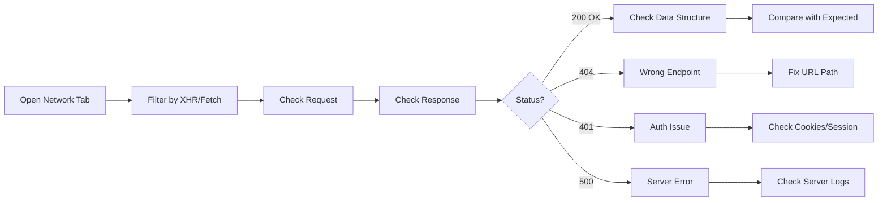
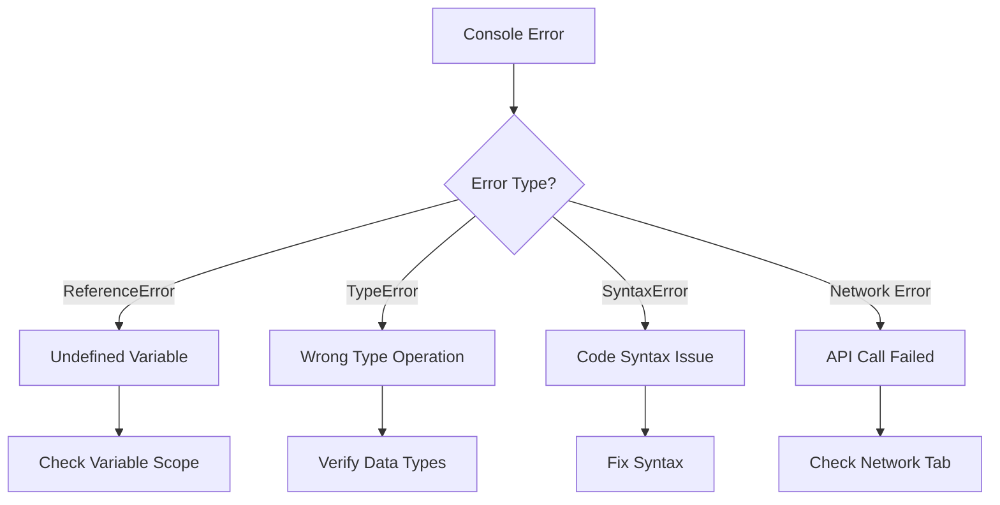
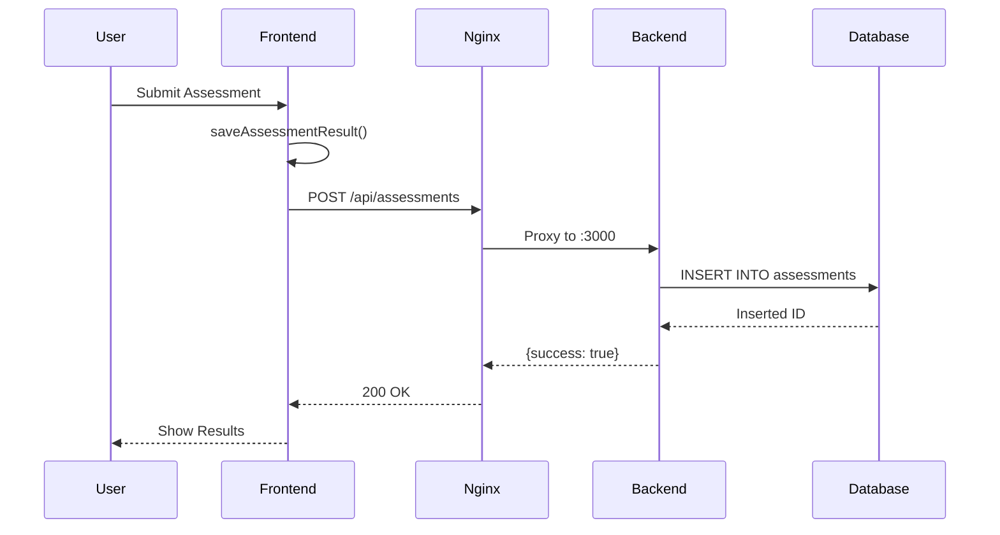
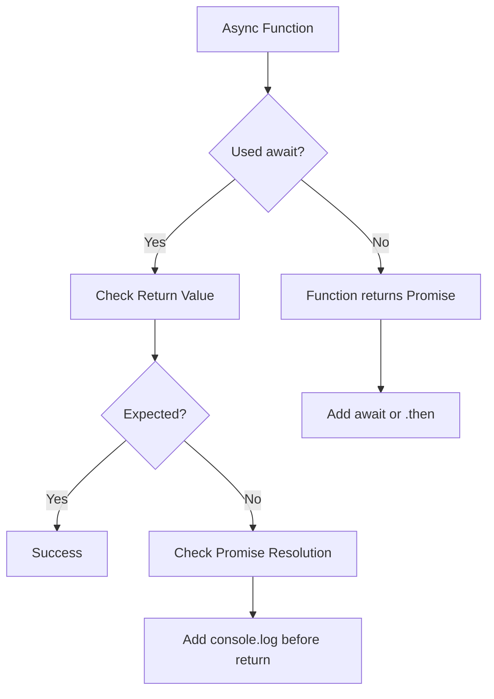
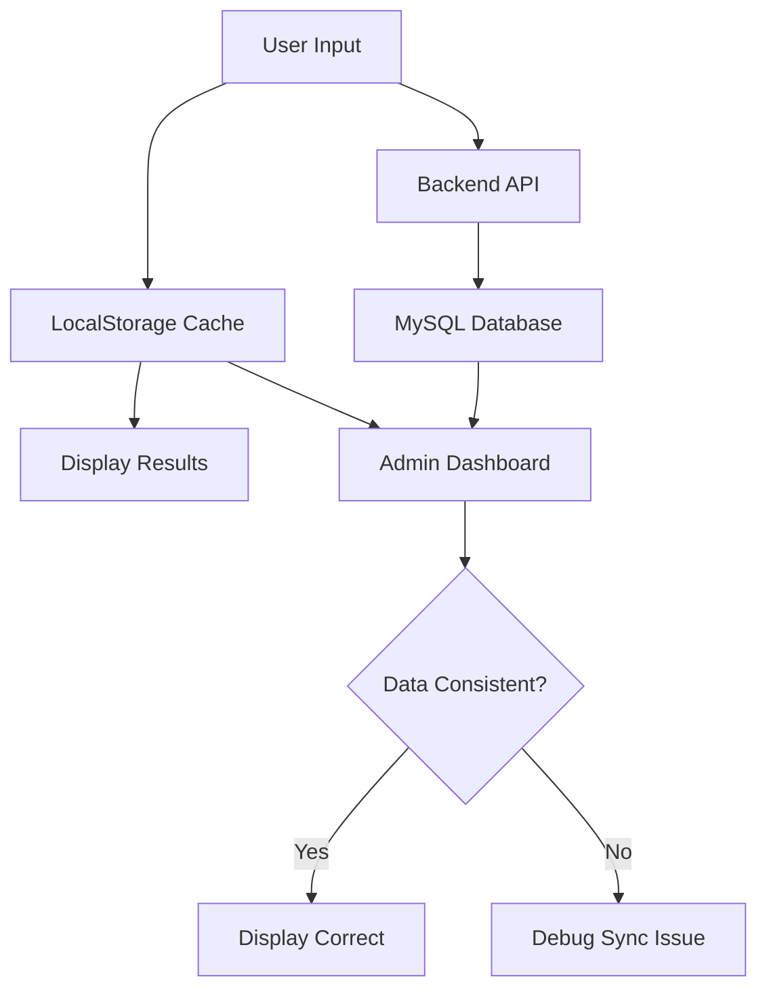
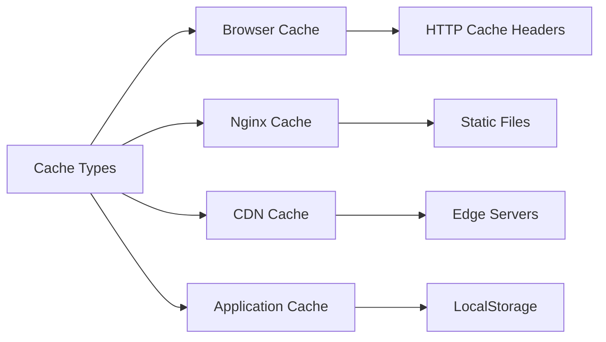
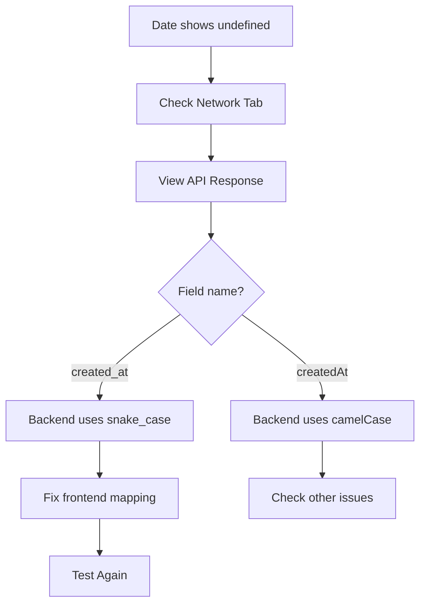
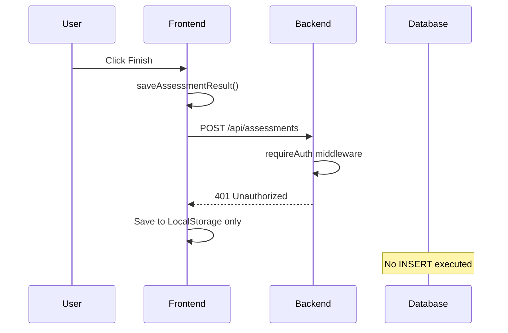
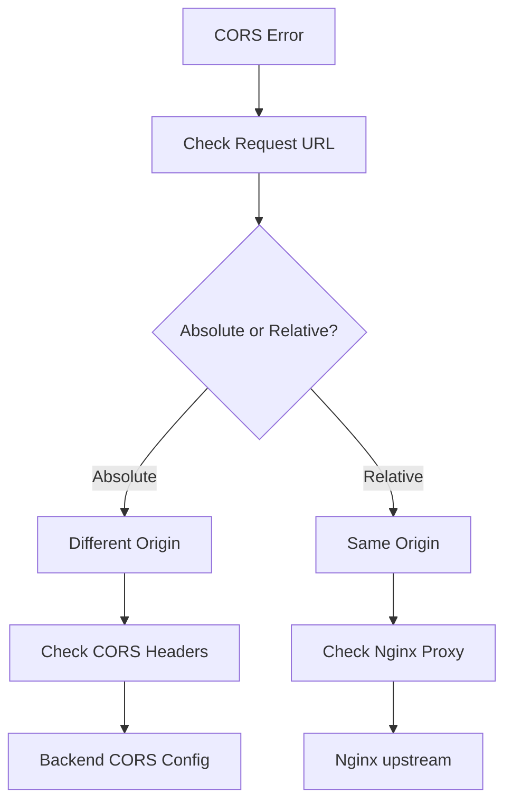

# 01 - Frontend Debugging Guide

> Comprehensive debugging techniques for the Career Assessment System frontend

## Table of Contents
1. [Browser Developer Tools](#browser-developer-tools)
2. [API Call Debugging](#api-call-debugging)
3. [JavaScript Async Debugging](#javascript-async-debugging)
4. [Data Flow Validation](#data-flow-validation)
5. [Caching Issues](#caching-issues)
6. [Real-World Case Studies](#real-world-case-studies)

---

## Browser Developer Tools

### Network Panel Analysis



#### Key Inspection Points

1. **Request Headers**
   - Method (GET/POST/PUT/DELETE)
   - URL path
   - Content-Type
   - Cookies sent

2. **Request Payload** (for POST/PUT)
   ```json
   {
     "assessmentId": "12345",
     "userInfo": { ... },
     "scores": { ... }
   }
   ```

3. **Response Headers**
   - Status code
   - Content-Type
   - Set-Cookie headers

4. **Response Body**
   - JSON structure
   - Field names (camelCase vs snake_case)
   - Null/undefined values

#### Example: Debugging API Response

```javascript
// Problem: API returns 200 but data shows undefined
// Solution: Check response structure

// Step 1: In Network tab, click the request
// Step 2: Check "Preview" or "Response" tab
// Expected:
{
  "success": true,
  "data": {
    "assessments": [
      {
        "id": "12345",
        "name": "张三",
        "createdAt": "2026/3/19 14:00:32"  // ✅ Correct field
      }
    ]
  }
}

// Actual (wrong field name):
{
  "success": true,
  "data": {
    "assessments": [
      {
        "id": "12345",
        "name": "张三",
        "created_at": "2026-03-19T14:00:32Z"  // ❌ Wrong field name
      }
    ]
  }
}

// Fix in JavaScript:
date: a.created_at  // Instead of a.createdAt
```

### Console Panel Debugging



#### Console Methods for Debugging

```javascript
// Basic logging
console.log('Debug info:', variable);

// Structured data
console.table(assessments);

// Group related logs
console.group('Assessment Data');
console.log('User:', userInfo);
console.log('Scores:', scores);
console.groupEnd();

// Timing operations
console.time('saveAssessment');
await saveAssessment(data);
console.timeEnd('saveAssessment');

// Trace execution
console.trace('Function called from:');
```

### Application Panel (Storage)

#### LocalStorage Inspection
```javascript
// View all data
console.log(JSON.parse(localStorage.getItem('careerAssessments')));

// Clear specific data
localStorage.removeItem('careerAssessments');

// Clear all
localStorage.clear();
```

#### Cookies Inspection
- Check session cookies for authentication
- Verify `connect.sid` cookie exists after login
- Check expiration dates

---

## API Call Debugging

### Frontend API Layer Analysis



### Debugging API Integration

#### Step 1: Verify API Client Configuration

```javascript
// File: frontend/js/api.js
const API_BASE_URL = '/api';  // ✅ Correct: Uses relative path

// ❌ Wrong: Absolute path causes CORS
const API_BASE_URL = 'http://localhost:3000/api';
```

#### Step 2: Test API with curl

```bash
# Test without authentication (public endpoint)
curl -X POST http://localhost:8080/api/assessments \
  -H "Content-Type: application/json" \
  -d '{
    "assessmentId": "test123",
    "userInfo": {"name": "Test"},
    "scores": {"totalScore": 85}
  }'

# Expected response:
{"success":true,"message":"测评结果保存成功"}
```

#### Step 3: Check Authentication Flow

```javascript
// Admin login test
await AdminAPI.login('Lonlink789');

// Check if cookie is set
document.cookie;  // Should contain 'connect.sid'

// Verify authentication
await AdminAPI.checkAuth();
// Expected: {success: true, isLoggedIn: true}
```

---

## JavaScript Async Debugging

### Common Async Issues



### Case 1: Missing await

```javascript
// ❌ WRONG: Data saved after page navigation
function finishAssessment() {
    const scores = calculateScores();
    saveAssessmentResult(scores);  // No await!
    showResults();  // Executes immediately
}

// ✅ CORRECT: Wait for save to complete
async function finishAssessment() {
    const scores = calculateScores();
    await saveAssessmentResult(scores);  // Wait for API
    showResults();  // Executes after save
}
```

### Case 2: Function Not Returning Promise

```javascript
// ❌ WRONG: Function doesn't return promise
function saveAssessmentResult(scores) {
    AssessmentAPI.create(data).then(() => {
        console.log('Saved');
    });
    // Returns undefined!
}

// ✅ CORRECT: Return the promise
async function saveAssessmentResult(scores) {
    await AssessmentAPI.create(data);
    console.log('Saved');
}
```

### Case 3: Parallel vs Sequential Execution

```javascript
// ❌ WRONG: Sequential but looks parallel
async function updateDashboard() {
    await updateStats();      // Wait
    await updateCharts();     // Wait
    await updateList();       // Wait
    // Total time = sum of all
}

// ✅ CORRECT: Parallel execution
async function updateDashboard() {
    await Promise.all([
        updateStats(),
        updateCharts(),
        updateList()
    ]);
    // Total time = max of all
}
```

### Debugging Async with DevTools

1. **Add breakpoints**
   - Open Sources tab
   - Find your JavaScript file
   - Click line number to add breakpoint

2. **Step through execution**
   - F10: Step over
   - F11: Step into
   - F8: Continue
   - Shift+F11: Step out

3. **Inspect variables**
   - Hover over variables to see values
   - Check Scope panel for all variables
   - Use Console to evaluate expressions

---

## Data Flow Validation

### Data Flow Diagram



### Validating Data Consistency

#### Check 1: LocalStorage Structure

```javascript
// Expected structure
const assessment = {
    id: "1234567890",
    userInfo: {
        name: "张三",
        major: "计算机科学",
        class: "软件1班",
        email: "zhangsan@example.com",
        school: "某某大学",
        phone: "13800138000",
        education: "本科"
    },
    scores: {
        totalScore: 85,
        dimensionScores: [
            {name: "沟通表达", score: 90},
            {name: "团队协作", score: 85}
        ]
    },
    date: "2026/3/19",
    time: 120  // seconds
};

// Validate
const assessments = JSON.parse(localStorage.getItem('careerAssessments'));
console.assert(Array.isArray(assessments), 'Should be array');
console.assert(assessments[0].userInfo, 'Should have userInfo');
console.assert(assessments[0].scores.totalScore, 'Should have totalScore');
```

#### Check 2: API to Frontend Mapping

```javascript
// Backend returns:
{
    "id": "12345",
    "name": "张三",
    "className": "软件1班",  // Backend field
    "createdAt": "2026/3/19"
}

// Frontend maps to:
{
    id: a.id,
    userInfo: {
        name: a.name,
        class: a.className  // ✅ Mapped correctly
    },
    date: a.createdAt
}
```

#### Check 3: Date Format Validation

```javascript
// Common date issues
const dateValue = assessment.date;

// Check if valid date
if (dateValue === undefined) {
    console.error('Date is undefined!');
    console.log('Assessment object:', assessment);
    // Fix: Check backend field name (created_at vs createdAt)
}

// Format display
const formattedDate = new Date(dateValue).toLocaleDateString('zh-CN');
// Expected: "2026/3/19"
```

---

## Caching Issues

### Types of Cache



### Browser Cache Clearing

#### Method 1: Force Reload
- **Windows/Linux**: `Ctrl + Shift + R` or `Ctrl + F5`
- **Mac**: `Cmd + Shift + R`
- **Effect**: Bypasses browser cache for current page

#### Method 2: Disable Cache in DevTools
1. Open DevTools (F12)
2. Go to Network tab
3. Check "Disable cache" checkbox
4. Keep DevTools open while testing

#### Method 3: Clear Specific Cache
```javascript
// Clear LocalStorage
localStorage.clear();

// Clear SessionStorage
sessionStorage.clear();

// Unregister Service Workers
navigator.serviceWorker.getRegistrations().then(registrations => {
    registrations.forEach(reg => reg.unregister());
});
```

#### Method 4: Hard Reload with Empty Cache
1. Open DevTools
2. Right-click refresh button
3. Select "Empty Cache and Hard Reload"

### Nginx Cache Issues

If static files (JS/CSS) are cached by Nginx:

```nginx
# In nginx.conf, disable cache for development
location ~* \\.(js|css)$ {
    expires -1;  # Disable caching
    add_header Cache-Control "no-cache, no-store, must-revalidate";
}
```

---

## Real-World Case Studies

### Case 1: Data Shows "undefined" in Admin Dashboard

**Symptoms:**
- Admin dashboard shows "undefined" for dates
- Other data displays correctly

**Root Cause:**
Backend returns `created_at` but frontend expects `createdAt`

**Debugging Steps:**



**Solution:**
```javascript
// ❌ Wrong
const date = assessment.createdAt;  // undefined

// ✅ Correct
const date = assessment.created_at;  // "2026/3/19"

// Or map in API layer
date: a.created_at || a.createdAt  // Fallback
```

### Case 2: Assessment Not Saved to Database

**Symptoms:**
- User completes assessment
- LocalStorage has data
- MySQL table is empty

**Root Cause Analysis:**



**Debugging Steps:**

1. **Check Network Tab**
   - Look for POST request to `/api/assessments`
   - Check response status

2. **Test with curl**
   ```bash
   # Without auth (should work for create)
   curl -X POST http://localhost:8080/api/assessments ...
   
   # If returns 401, route requires auth
   ```

3. **Check Backend Routes**
   ```javascript
   // ❌ Wrong: All routes protected
   app.use('/api/assessments', requireAuth, assessmentRoutes);
   
   // ✅ Correct: Create is public
   app.post('/api/assessments', assessmentController.createAssessment);
   app.use('/api/assessments', requireAuth, assessmentRoutes);
   ```

**Solution:**
Move create endpoint outside auth middleware.

### Case 3: Async Function Returns Before API Completes

**Symptoms:**
- Results page shows before data saved
- Sometimes data missing on refresh
- Race condition

**Code Analysis:**

```javascript
// ❌ PROBLEMATIC CODE
function handleFinish() {
    saveAssessment(scores);  // Async, not awaited
    showResultsPage();       // Runs immediately
    // API might not complete before page change
}

// ✅ FIXED CODE
async function handleFinish() {
    await saveAssessment(scores);  // Wait for completion
    showResultsPage();              // Only after save
}
```

**Verification:**
Add console logs to track execution:

```javascript
async function saveAssessment(scores) {
    console.log('Starting save...');
    await AssessmentAPI.create(data);
    console.log('Save complete!');  // Should see this before results
}

async function handleFinish() {
    await saveAssessment(scores);
    console.log('Now showing results');  // Should be after "Save complete"
}
```

### Case 4: CORS Error on API Call

**Symptoms:**
- Console shows "CORS policy" error
- Network tab shows request blocked

**Debugging:**



**Common Causes:**

1. **Wrong API URL**
   ```javascript
   // ❌ Wrong - Absolute URL
   const API_BASE_URL = 'http://localhost:3000/api';
   
   // ✅ Correct - Relative URL
   const API_BASE_URL = '/api';
   ```

2. **Missing CORS Headers**
   ```javascript
   // Backend must set headers
   app.use(cors({
       origin: 'http://localhost:8080',
       credentials: true
   }));
   ```

**Solution:**
Use relative URLs so Nginx handles proxying.

### Case 5: Charts Not Updating After New Assessment

**Symptoms:**
- New assessment saved to database
- Admin dashboard charts show old data
- Refresh page fixes it

**Root Cause:**
Charts initialized once, not updated when new data arrives.

**Debugging Steps:**

```javascript
// Check if chart instance exists
console.log('Chart instance:', window.adminDimensionsChart);

// If exists, destroy before creating new
if (window.adminDimensionsChart) {
    window.adminDimensionsChart.destroy();
}

// Create new chart with updated data
window.adminDimensionsChart = new Chart(ctx, { ... });
```

**Solution Pattern:**

```javascript
async function updateCharts() {
    const stats = await AssessmentAPI.getStatistics();
    
    // Destroy old charts
    if (window.adminDimensionsChart) {
        window.adminDimensionsChart.destroy();
    }
    
    // Create new charts with fresh data
    window.adminDimensionsChart = new Chart(ctx, {
        data: stats.dimensionAverages
    });
}
```

---

## Debug Checklist

When reporting a frontend issue, check:

- [ ] Browser console for JavaScript errors
- [ ] Network tab for failed API calls
- [ ] Response data structure matches expectations
- [ ] No CORS errors in console
- [ ] LocalStorage has expected data
- [ ] Cookies are set correctly (for auth)
- [ ] Tried hard refresh (Ctrl+F5)
- [ ] Checked in incognito/private mode
- [ ] Verified field names (camelCase vs snake_case)
- [ ] Confirmed async/await usage

---

## Quick Commands

```bash
# Test API endpoint
curl -s http://localhost:8080/api/health | python3 -m json.tool

# Check LocalStorage from command line (via Node if needed)
# Or use browser console: JSON.parse(localStorage.getItem('key'))

# Clear browser cache programmatically
# In browser console: location.reload(true)
```

---

**Next**: [02-backend-debugging.md](02-backend-debugging.md) - Node.js and API debugging