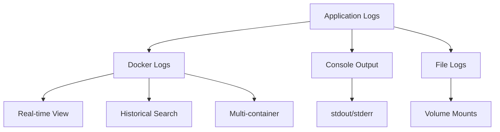
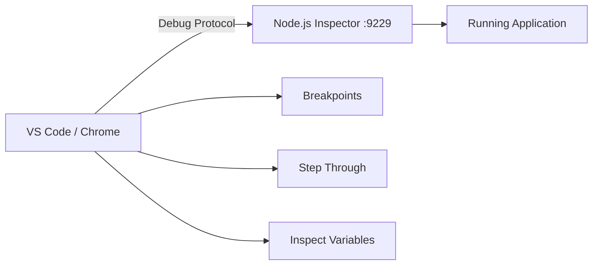
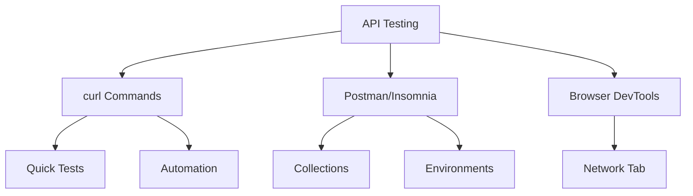
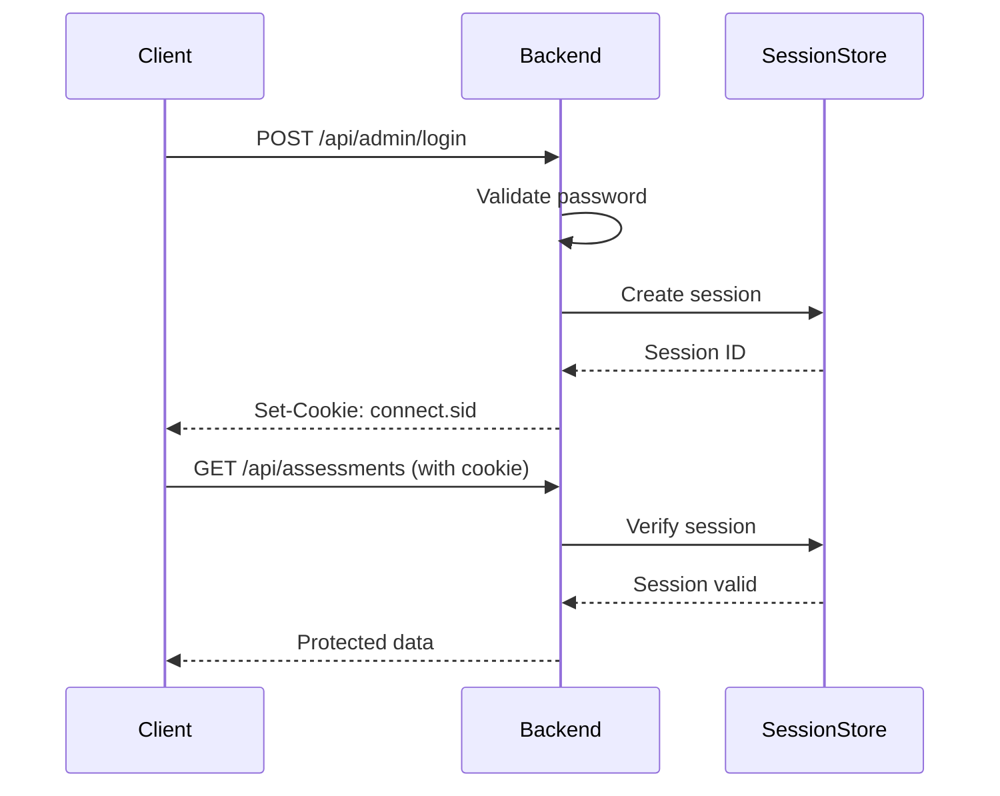
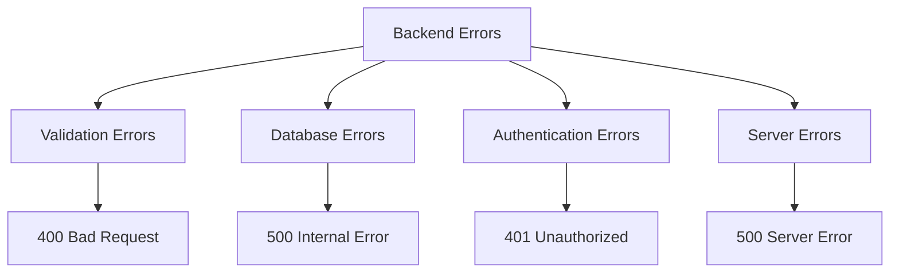
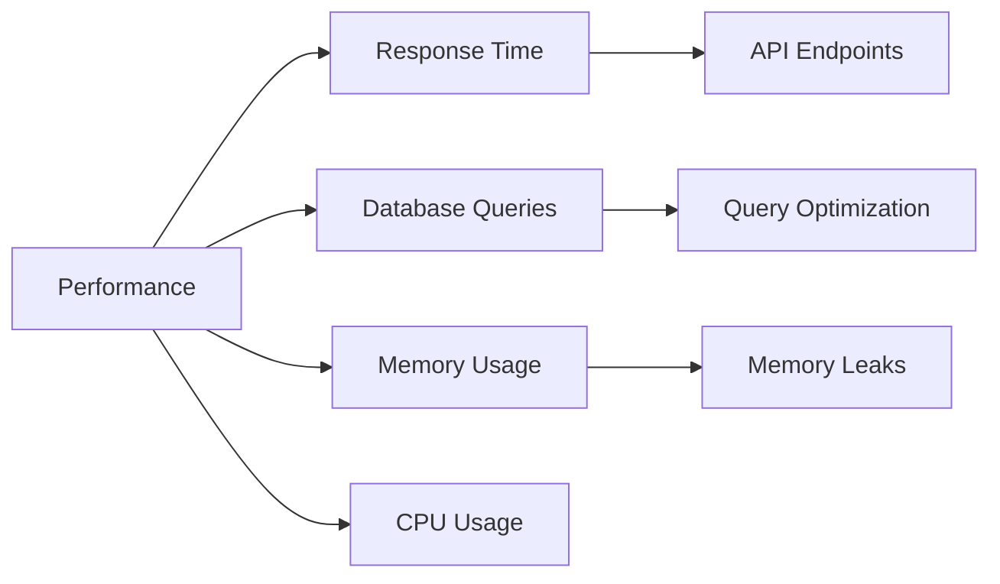

# 02 - Backend Debugging Guide

> Comprehensive debugging techniques for Node.js, Express, and API layer

## Table of Contents
1. [Docker Logs Analysis](#docker-logs-analysis)
2. [Node.js Inspector Debugging](#nodejs-inspector-debugging)
3. [API Endpoint Testing](#api-endpoint-testing)
4. [Authentication & Session Debugging](#authentication--session-debugging)
5. [Error Handling & Stack Traces](#error-handling--stack-traces)
6. [Performance Debugging](#performance-debugging)

---

## Docker Logs Analysis

### Container Logs Overview



### Essential Log Commands

```bash
# View all service logs
docker-compose logs

# Follow logs in real-time
docker-compose logs -f

# View specific service logs
docker-compose logs -f backend

# View last 100 lines
docker-compose logs --tail=100 backend

# View logs since specific time
docker-compose logs --since=2026-03-19T10:00:00 backend

# Combine filters
docker-compose logs -f --tail=50 backend

# Search for specific errors
docker-compose logs backend | grep -i error

# Save logs to file
docker-compose logs backend > backend-logs.txt
```

### Log Pattern Analysis

#### Startup Sequence (Normal)
```
career-backend  | ✓ 数据库连接成功
career-backend  | ✓ 数据库模型同步完成
career-backend  | ✓ 服务器运行在端口 3000
career-backend  | ✓ API地址: http://localhost:3000/api
career-backend  | ✓ 健康检查: http://localhost:3000/api/health
```

#### API Request Logging (with Morgan)
```
career-backend  | POST /api/assessments 201 15.234 ms - 92
career-backend  | GET /api/assessments/statistics 200 8.123 ms - 245
career-backend  | POST /api/admin/login 200 3.456 ms - 35
```

#### Error Log Pattern
```
career-backend  | Error: Connection refused
    at TCPConnectWrap.afterConnect [as oncomplete] (net.js:1141:16)
career-backend  | Error: Validation error
    at Assessment.create (/app/src/models/Assessment.js:15:11)
```

### Common Log Messages

| Message | Meaning | Action |
|---------|---------|--------|
| `✓ 数据库连接成功` | MySQL connected | ✅ Normal |
| `✗ 数据库连接失败` | Cannot connect to MySQL | Check MySQL container status |
| `Executing (default): SELECT ...` | Sequelize query executed | ✅ Normal (development) |
| `POST /api/... 401` | Unauthorized request | Check authentication |
| `POST /api/... 500` | Server error | Check stack trace |
| `UnhandledPromiseRejection` | Async error not caught | Add try-catch blocks |

---

## Node.js Inspector Debugging

### Debug Architecture



### Using Chrome DevTools

1. **Open Chrome Inspector**
   - Navigate to `chrome://inspect`
   - Click "Open dedicated DevTools for Node"

2. **Configure Connection**
   - Host: `localhost`
   - Port: `9229`

3. **Set Breakpoints**
   - Open your source file
   - Click line numbers to set breakpoints
   - Breakpoints persist across restarts

### Using VS Code

#### Launch Configuration

Create `.vscode/launch.json`:

```json
{
  "version": "0.2.0",
  "configurations": [
    {
      "type": "node",
      "request": "attach",
      "name": "Debug Backend (Docker)",
      "address": "localhost",
      "port": 9229,
      "localRoot": "${workspaceFolder}/backend",
      "remoteRoot": "/app",
      "skipFiles": ["<node_internals>/**"]
    },
    {
      "type": "node",
      "request": "launch",
      "name": "Debug Backend (Local)",
      "cwd": "${workspaceFolder}/backend",
      "runtimeExecutable": "npm",
      "runtimeArgs": ["run", "dev"],
      "envFile": "${workspaceFolder}/.env",
      "console": "integratedTerminal"
    }
  ]
}
```

#### Debugging Steps

1. **Start container with debug**
   ```bash
   docker-compose up -d
   ```

2. **Attach debugger**
   - Press F5 in VS Code
   - Select "Debug Backend (Docker)"

3. **Set breakpoints**
   - Open `backend/src/controllers/assessmentController.js`
   - Click gutter next to line numbers

4. **Trigger breakpoint**
   - Make API request (via browser or curl)
   - Execution pauses at breakpoint

5. **Inspect variables**
   - Hover over variables
   - Check Variables panel
   - Use Debug Console: `req.body`

### Key Debugging Features

```javascript
// Add explicit debugger statement
debugger;  // Execution pauses here when inspector attached

// Conditional breakpoint
if (req.body.assessmentId === 'test123') {
    debugger;  // Only breaks for specific ID
}

// Logpoint (VS Code feature)
// Right-click gutter → "Add Logpoint"
// Message: "Creating assessment: {req.body.assessmentId}"
```

---

## API Endpoint Testing

### Testing Workflow



### curl Command Reference

#### Health Check
```bash
# Test if backend is running
curl -s http://localhost:8080/api/health | python3 -m json.tool

# Expected response:
{
    "status": "ok",
    "timestamp": "2026-03-19T10:30:00.000Z",
    "version": "1.0.0"
}
```

#### Create Assessment (Public)
```bash
curl -X POST http://localhost:8080/api/assessments \
  -H "Content-Type: application/json" \
  -d '{
    "assessmentId": "12345",
    "userInfo": {
      "name": "测试用户",
      "major": "计算机科学",
      "class": "软件工程1班",
      "email": "test@test.com",
      "school": "测试大学",
      "phone": "13800138000",
      "education": "本科"
    },
    "answers": [0, 1, 2, 3, 4],
    "scores": {
      "totalScore": 85,
      "dimensionScores": [
        {"name": "沟通表达", "score": 90},
        {"name": "团队协作", "score": 85}
      ]
    },
    "timeElapsed": 120
  }' | python3 -m json.tool
```

#### Admin Login
```bash
# Login and save cookies
curl -X POST http://localhost:8080/api/admin/login \
  -H "Content-Type: application/json" \
  -d '{"password": "Lonlink789"}' \
  -c cookies.txt \
  -v

# Expected: Set-Cookie: connect.sid=...
```

#### Authenticated Requests
```bash
# Use saved cookies
curl -s http://localhost:8080/api/assessments \
  -b cookies.txt | python3 -m json.tool

# Get statistics
curl -s http://localhost:8080/api/assessments/statistics \
  -b cookies.txt | python3 -m json.tool
```

#### Export Excel
```bash
# Download file
curl -s http://localhost:8080/api/admin/export \
  -b cookies.txt \
  -o assessments.xlsx

# With filters
curl -s "http://localhost:8080/api/admin/export?major=计算机" \
  -b cookies.txt \
  -o filtered.xlsx
```

### API Response Debugging

#### Check Response Structure
```bash
# Pipe through jq for better formatting
curl -s http://localhost:8080/api/assessments -b cookies.txt | jq '.'

# Extract specific field
curl -s http://localhost:8080/api/assessments -b cookies.txt | jq '.data.total'

# Filter assessments
curl -s http://localhost:8080/api/assessments -b cookies.txt | \
  jq '.data.assessments[] | {name, totalScore}'
```

#### Timing Analysis
```bash
# Measure response time
curl -w "@curl-format.txt" -s -o /dev/null http://localhost:8080/api/health

# curl-format.txt:
# time_namelookup: %{time_namelookup}\n
# time_connect: %{time_connect}\n
# time_appconnect: %{time_appconnect}\n
# time_pretransfer: %{time_pretransfer}\n
# time_redirect: %{time_redirect}\n
# time_starttransfer: %{time_starttransfer}\n
# time_total: %{time_total}\n
```

---

## Authentication & Session Debugging

### Session Flow



### Session Debugging

#### Check Session Configuration
```javascript
// backend/src/app.js
app.use(session({
  secret: process.env.SESSION_SECRET,
  resave: false,
  saveUninitialized: false,
  cookie: {
    secure: false,  // Must be false for HTTP
    maxAge: 24 * 60 * 60 * 1000
  }
}));
```

#### Verify Session in Route
```javascript
// Debug middleware
app.use((req, res, next) => {
  console.log('Session ID:', req.sessionID);
  console.log('Session Data:', req.session);
  console.log('Is Admin:', req.session.isAdmin);
  next();
});
```

#### Test Session with curl
```bash
# Step 1: Login and save cookies
curl -X POST http://localhost:8080/api/admin/login \
  -H "Content-Type: application/json" \
  -d '{"password": "Lonlink789"}' \
  -c cookies.txt -v

# Check cookies file
cat cookies.txt

# Step 2: Use cookies for authenticated request
curl -s http://localhost:8080/api/admin/check \
  -b cookies.txt

# Expected: {"success": true, "isLoggedIn": true}
```

#### Common Auth Issues

| Issue | Cause | Solution |
|-------|-------|----------|
| 401 on every request | Session not persisted | Check cookie settings |
| Session lost on refresh | saveUninitialized: true | Set to false |
| Cookie not sent | secure: true on HTTP | Set secure: false |
| Admin check fails | isAdmin not set | Debug login route |

---

## Error Handling & Stack Traces

### Error Types



### Reading Stack Traces

#### Example Error
```javascript
Error: Validation error
    at Assessment.create (/app/src/models/Assessment.js:15:11)
    at async createAssessment (/app/src/controllers/assessmentController.js:25:22)
    at async Layer.handle (/app/node_modules/express/lib/router/layer.js:95:5)
```

**Analysis:**
1. **Error type**: Validation error
2. **Location**: `Assessment.js` line 15
3. **Called from**: `assessmentController.js` line 25
4. **Root cause**: Data validation failed before database insert

### Global Error Handler

```javascript
// backend/src/middleware/errorHandler.js
exports.errorHandler = (err, req, res, next) => {
  console.error('Error Details:', {
    message: err.message,
    stack: err.stack,
    path: req.path,
    method: req.method,
    body: req.body
  });

  // Sequelize validation error
  if (err.name === 'SequelizeValidationError') {
    return res.status(400).json({
      error: 'Validation failed',
      details: err.errors.map(e => ({
        field: e.path,
        message: e.message
      }))
    });
  }

  // Default error
  res.status(500).json({
    error: 'Internal server error',
    message: process.env.NODE_ENV === 'development' ? err.message : undefined
  });
};
```

### Debugging Specific Errors

#### Sequelize Validation Error
```bash
# Log shows:
Validation error: assessmentId cannot be null

# Solution:
# Check request body includes assessmentId
# Add validation in controller
```

#### Connection Refused
```bash
# Log shows:
Error: connect ECONNREFUSED 172.18.0.2:3306

# Solution:
docker-compose ps  # Check if MySQL is running
docker-compose logs mysql  # Check MySQL logs
```

#### Promise Rejection
```bash
# Log shows:
UnhandledPromiseRejectionWarning: Error: Something bad happened

# Solution:
# Add try-catch to async functions
# Or use .catch() on promises
```

---

## Performance Debugging

### Performance Metrics



### Response Time Analysis

```javascript
// Add response time middleware
app.use((req, res, next) => {
  const start = Date.now();
  
  res.on('finish', () => {
    const duration = Date.now() - start;
    console.log(`${req.method} ${req.path} - ${duration}ms`);
    
    if (duration > 1000) {
      console.warn('Slow request detected!');
    }
  });
  
  next();
});
```

### Database Query Optimization

```javascript
// Enable Sequelize query logging
const sequelize = new Sequelize({
  // ... config
  logging: (msg) => {
    console.log('SQL:', msg);
  }
});

// Check for N+1 queries
// Bad: Loop with individual queries
for (const id of ids) {
  await Assessment.findByPk(id);  // N queries
}

// Good: Single query with IN clause
await Assessment.findAll({
  where: { id: { [Op.in]: ids } }
});  // 1 query
```

### Memory Leak Detection

```bash
# Monitor memory usage
docker stats career-backend

# Output:
CONTAINER ID   NAME             CPU %   MEM USAGE / LIMIT
abc123         career-backend   0.5%    125MB / 512MB
```

```javascript
// Add memory usage logging
setInterval(() => {
  const usage = process.memoryUsage();
  console.log('Memory usage:', {
    rss: `${Math.round(usage.rss / 1024 / 1024)}MB`,
    heapTotal: `${Math.round(usage.heapTotal / 1024 / 1024)}MB`,
    heapUsed: `${Math.round(usage.heapUsed / 1024 / 1024)}MB`
  });
}, 60000);  // Every minute
```

---

## Debug Checklist

When backend issues occur:

- [ ] Check Docker logs: `docker-compose logs -f backend`
- [ ] Verify API health: `curl http://localhost:8080/api/health`
- [ ] Test with curl (bypass frontend)
- [ ] Check database connection
- [ ] Verify authentication flow
- [ ] Review error stack traces
- [ ] Check response times
- [ ] Verify environment variables
- [ ] Test in development mode for detailed errors

---

**Next**: [03-database-debugging.md](03-database-debugging.md) - MySQL queries and data validation