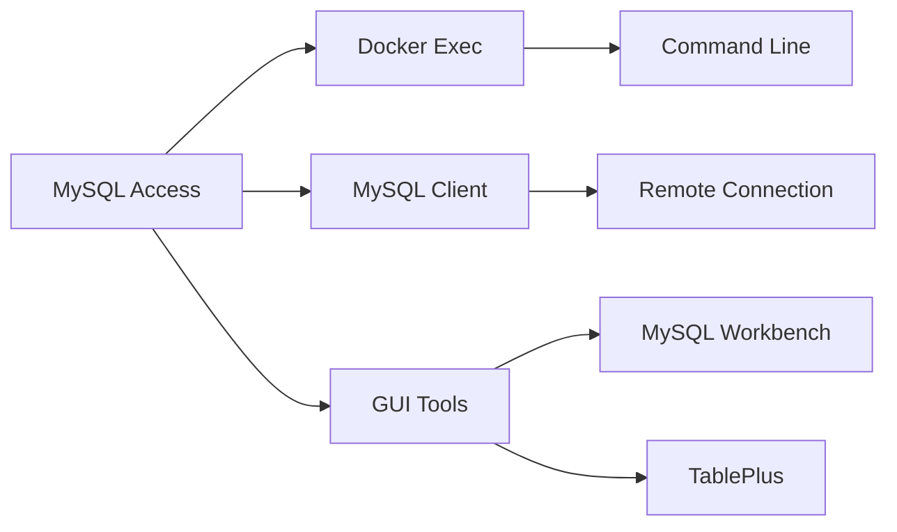
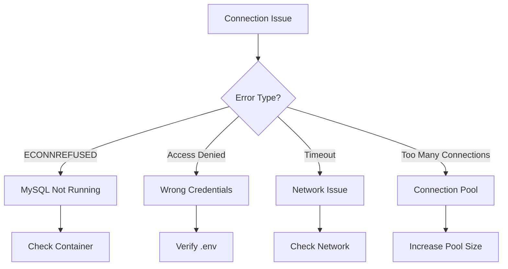

# 03 - Database Debugging Guide

> Comprehensive MySQL debugging and data validation techniques

## Table of Contents
1. [MySQL Container Access](#mysql-container-access)
2. [Data Verification Queries](#data-verification-queries)
3. [Schema and Index Inspection](#schema-and-index-inspection)
4. [Connection Troubleshooting](#connection-troubleshooting)
5. [Performance Optimization](#performance-optimization)
6. [Data Migration and Backup](#data-migration-and-backup)

---

## MySQL Container Access

### Access Methods



### Docker Exec Commands

```bash
# Enter MySQL container shell
docker-compose exec mysql bash

# Direct MySQL CLI access
docker-compose exec mysql mysql -u root -p

# Execute single query
docker-compose exec mysql mysql -u root -ppassword -e "SHOW DATABASES;"

# Execute query with database context
docker-compose exec mysql mysql -u root -ppassword -e "USE career_assessment; SELECT * FROM assessments;"

# Run SQL file
docker-compose exec -T mysql mysql -u root -ppassword < database/init.sql
```

### Interactive MySQL Session

```bash
# Start interactive session
docker-compose exec mysql mysql -u root -ppassword

Welcome to the MySQL monitor.  Commands end with ; or \g.
Your MySQL connection id is 123

mysql> USE career_assessment;
Database changed

mysql> SHOW TABLES;
+---------------------------+
| Tables_in_career_assessment |
+---------------------------+
| admins                    |
| assessments               |
+---------------------------+

mysql> EXIT;
```

---

## Data Verification Queries

### Basic Data Inspection

```sql
-- Count total assessments
SELECT COUNT(*) as total_assessments FROM assessments;

-- Get recent assessments (last 10)
SELECT 
    assessment_id,
    name,
    major,
    total_score,
    created_at
FROM assessments
ORDER BY created_at DESC
LIMIT 10;

-- Get assessment by ID
SELECT * FROM assessments WHERE assessment_id = '12345';

-- Search by name
SELECT * FROM assessments WHERE name LIKE '%张%';

-- Filter by score range
SELECT * FROM assessments 
WHERE total_score BETWEEN 80 AND 90
ORDER BY total_score DESC;
```

### Statistics Queries

```sql
-- Average scores by major
SELECT 
    major,
    COUNT(*) as count,
    AVG(total_score) as avg_score,
    MIN(total_score) as min_score,
    MAX(total_score) as max_score
FROM assessments
GROUP BY major
ORDER BY avg_score DESC;

-- Score distribution
SELECT 
    CASE 
        WHEN total_score >= 90 THEN '90-100'
        WHEN total_score >= 80 THEN '80-89'
        WHEN total_score >= 70 THEN '70-79'
        WHEN total_score >= 60 THEN '60-69'
        ELSE '0-59'
    END as score_range,
    COUNT(*) as count
FROM assessments
GROUP BY score_range
ORDER BY score_range DESC;

-- Daily submissions
SELECT 
    DATE(created_at) as date,
    COUNT(*) as count
FROM assessments
GROUP BY DATE(created_at)
ORDER BY date DESC
LIMIT 30;
```

### Data Quality Checks

```sql
-- Check for null values in critical fields
SELECT * FROM assessments 
WHERE name IS NULL 
   OR email IS NULL 
   OR total_score IS NULL;

-- Check for duplicate assessment IDs
SELECT assessment_id, COUNT(*) as count
FROM assessments
GROUP BY assessment_id
HAVING count > 1;

-- Check JSON field validity
SELECT assessment_id, scores
FROM assessments
WHERE JSON_VALID(scores) = 0;

-- Verify email format (basic check)
SELECT assessment_id, email
FROM assessments
WHERE email NOT LIKE '%@%.%';
```

### JSON Field Queries

```sql
-- Extract specific score from JSON
SELECT 
    assessment_id,
    name,
    JSON_EXTRACT(scores, '$.totalScore') as total_score
FROM assessments
LIMIT 5;

-- Find assessments with high communication score
SELECT assessment_id, name, scores
FROM assessments
WHERE JSON_EXTRACT(scores, '$.dimensionScores[0].score') > 85;

-- Get all dimension scores for analysis
SELECT 
    assessment_id,
    name,
    JSON_EXTRACT(scores, '$.dimensionScores') as dimensions
FROM assessments
WHERE created_at > DATE_SUB(NOW(), INTERVAL 7 DAY);
```

---

## Schema and Index Inspection

### Table Structure

```sql
-- Show table structure
DESCRIBE assessments;

-- Detailed table information
SHOW CREATE TABLE assessments;

-- Show all columns with types
SELECT 
    COLUMN_NAME,
    DATA_TYPE,
    IS_NULLABLE,
    COLUMN_DEFAULT,
    EXTRA
FROM INFORMATION_SCHEMA.COLUMNS
WHERE TABLE_NAME = 'assessments';
```

### Index Verification

```sql
-- Show all indexes
SHOW INDEX FROM assessments;

-- Check if specific index exists
SELECT * FROM INFORMATION_SCHEMA.STATISTICS
WHERE TABLE_NAME = 'assessments' 
AND INDEX_NAME = 'idx_assessment_id';

-- Analyze index usage
EXPLAIN SELECT * FROM assessments WHERE assessment_id = '12345';

-- Should show:
-- type: const or ref (using index)
-- key: idx_assessment_id
```

### Schema Comparison

```sql
-- Compare actual schema with expected
-- Expected columns from init.sql:
-- id, assessment_id, name, major, class_name, email, school, 
-- phone, education, answers, option_maps, scores, total_score, 
-- time_elapsed, ip_address, user_agent, created_at, updated_at

-- Verify all expected columns exist
SELECT COLUMN_NAME
FROM INFORMATION_SCHEMA.COLUMNS
WHERE TABLE_NAME = 'assessments'
AND COLUMN_NAME IN (
    'id', 'assessment_id', 'name', 'major', 'class_name',
    'email', 'school', 'phone', 'education', 'answers',
    'option_maps', 'scores', 'total_score', 'time_elapsed',
    'ip_address', 'user_agent', 'created_at', 'updated_at'
);
```

---

## Connection Troubleshooting

### Connection Diagnostics



### Common Connection Errors

#### Error: Connection Refused
```bash
# Symptom:
Error: connect ECONNREFUSED 172.18.0.2:3306

# Check if MySQL is running:
docker-compose ps

# Output should show:
# career-mysql   Up 2 hours   0.0.0.0:3306->3306/tcp

# If not running:
docker-compose up -d mysql

# Check MySQL logs:
docker-compose logs mysql
```

#### Error: Access Denied
```bash
# Symptom:
Error: Access denied for user 'root'@'172.18.0.3'

# Verify password:
docker-compose exec mysql mysql -u root -p
# Enter password from .env file

# If wrong, check .env:
cat .env | grep DB_PASSWORD

# Reset password if needed:
docker-compose exec mysql mysql -u root -p -e "ALTER USER 'root'@'%' IDENTIFIED BY 'newpassword';"
```

#### Error: Connection Timeout
```bash
# Symptom:
Error: connect ETIMEDOUT

# Check network connectivity:
docker-compose exec backend ping mysql

# Check MySQL is listening:
docker-compose exec mysql netstat -tlnp | grep 3306

# Verify port mapping:
docker-compose port mysql 3306
```

### Connection Pool Monitoring

```javascript
// Monitor connection pool in backend
const sequelize = require('./config/sequelize');

// Log pool statistics
setInterval(async () => {
  const pool = sequelize.connectionManager.pool;
  console.log('Connection Pool:', {
    max: pool.maxSize,
    min: pool.minSize,
    current: pool.size,
    available: pool.available,
    using: pool.using,
    waiting: pool.waiting
  });
}, 30000);
```

---

## Performance Optimization

### Query Performance Analysis

```sql
-- Enable slow query log
SET GLOBAL slow_query_log = 'ON';
SET GLOBAL long_query_time = 2;  -- Log queries > 2 seconds

-- Find slow queries
SELECT * FROM mysql.slow_log 
ORDER BY start_time DESC 
LIMIT 10;

-- Analyze specific query
EXPLAIN ANALYZE 
SELECT * FROM assessments 
WHERE major = '计算机科学' 
ORDER BY created_at DESC 
LIMIT 10;
```

### Index Optimization

```sql
-- Add index for frequent queries
CREATE INDEX idx_major_created 
ON assessments(major, created_at);

-- Composite index for range queries
CREATE INDEX idx_score_range 
ON assessments(total_score, created_at);

-- Remove unused indexes
DROP INDEX idx_unused ON assessments;

-- Analyze table for query optimizer
ANALYZE TABLE assessments;
```

### Table Optimization

```sql
-- Check table status
SHOW TABLE STATUS LIKE 'assessments';

-- Optimize table (reclaim space)
OPTIMIZE TABLE assessments;

-- Check for fragmentation
SELECT 
    table_name,
    data_free,
    ROUND(data_free/1024/1024, 2) as free_mb
FROM information_schema.tables
WHERE table_name = 'assessments';
```

---

## Data Migration and Backup

### Backup Strategies

```bash
# Full database backup
docker-compose exec mysql mysqldump -u root -ppassword career_assessment > backup_$(date +%Y%m%d).sql

# Backup specific table
docker-compose exec mysql mysqldump -u root -ppassword career_assessment assessments > assessments_backup.sql

# Compressed backup
docker-compose exec mysql mysqldump -u root -ppassword career_assessment | gzip > backup_$(date +%Y%m%d).sql.gz

# Scheduled backup (cron)
# 0 2 * * * cd /path/to/project && ./backup.sh
```

### Restore Procedures

```bash
# Restore from backup
docker-compose exec -T mysql mysql -u root -ppassword career_assessment < backup_20260319.sql

# Restore compressed backup
gunzip < backup_20260319.sql.gz | docker-compose exec -T mysql mysql -u root -ppassword career_assessment

# Restore to new database
docker-compose exec mysql mysql -u root -ppassword -e "CREATE DATABASE career_assessment_new;"
docker-compose exec -T mysql mysql -u root -ppassword career_assessment_new < backup.sql
```

### Data Export/Import

```bash
# Export to CSV for Excel analysis
docker-compose exec mysql mysql -u root -ppassword -e "
SELECT * FROM assessments 
INTO OUTFILE '/tmp/assessments.csv'
FIELDS TERMINATED BY ','
ENCLOSED BY '\"'
LINES TERMINATED BY '\n';"

# Copy from container
docker-compose cp mysql:/tmp/assessments.csv ./

# Import from CSV
docker-compose exec mysql mysql -u root -ppassword -e "
LOAD DATA INFILE '/tmp/import.csv'
INTO TABLE assessments
FIELDS TERMINATED BY ','
ENCLOSED BY '\"'
LINES TERMINATED BY '\n'
IGNORE 1 ROWS;"
```

---

## Debug Checklist

When database issues occur:

- [ ] Verify MySQL container is running: `docker-compose ps`
- [ ] Check MySQL logs: `docker-compose logs mysql`
- [ ] Test connection: `docker-compose exec mysql mysql -u root -p`
- [ ] Verify data exists: `SELECT COUNT(*) FROM assessments;`
- [ ] Check recent records: `SELECT * FROM assessments ORDER BY created_at DESC LIMIT 5;`
- [ ] Verify indexes: `SHOW INDEX FROM assessments;`
- [ ] Check for errors in slow query log
- [ ] Validate JSON fields: `SELECT * WHERE JSON_VALID(scores) = 0;`
- [ ] Verify connection pool settings
- [ ] Check disk space: `df -h` inside container

---

## Quick Reference

```bash
# Most useful commands

# 1. Check database status
docker-compose ps mysql

# 2. View recent assessments
docker-compose exec mysql mysql -u root -ppassword -e "USE career_assessment; SELECT assessment_id, name, total_score, created_at FROM assessments ORDER BY created_at DESC LIMIT 5;"

# 3. Count records
docker-compose exec mysql mysql -u root -ppassword -e "USE career_assessment; SELECT COUNT(*) FROM assessments;"

# 4. Backup database
docker-compose exec mysql mysqldump -u root -ppassword career_assessment > backup.sql

# 5. Reset database (WARNING: Destroys data!)
docker-compose down -v
docker-compose up -d mysql
```

---

**Next**: [04-nginx-debugging.md](04-nginx-debugging.md) - Reverse proxy and static file serving