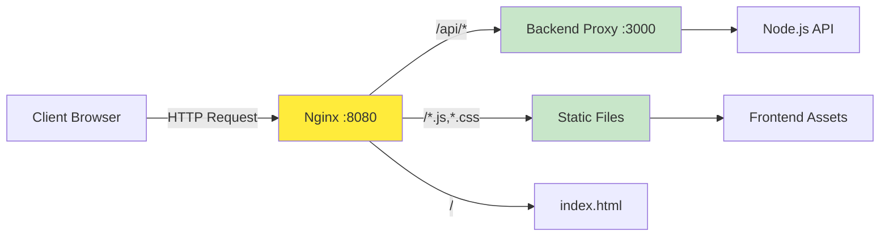
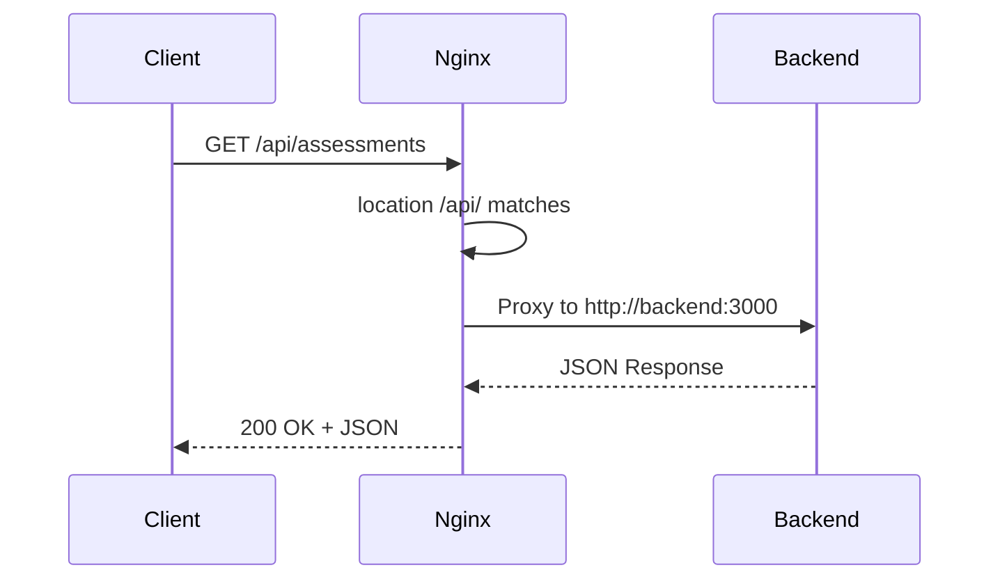
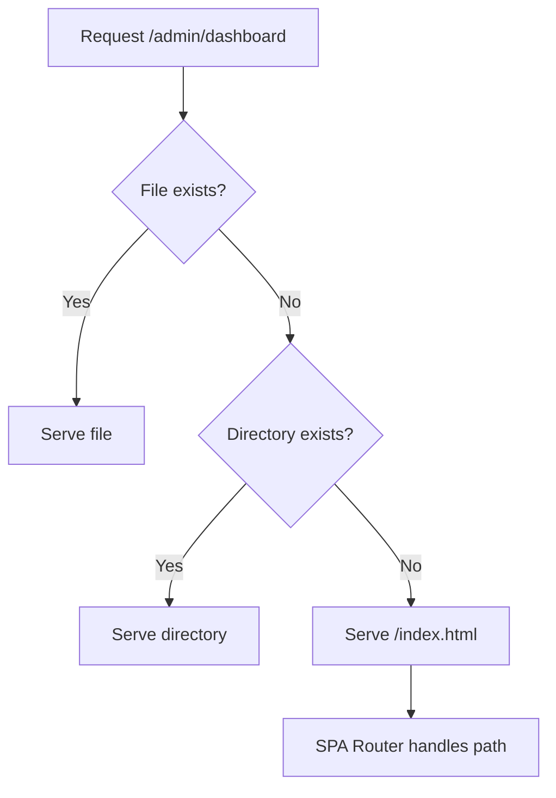

# 04 - Nginx Debugging Guide

> Comprehensive debugging for Nginx reverse proxy, routing, and static file serving

## Table of Contents
1. [Nginx Architecture Overview](#nginx-architecture-overview)
2. [Configuration Validation](#configuration-validation)
3. [Reverse Proxy Debugging](#reverse-proxy-debugging)
4. [Static File Serving](#static-file-serving)
5. [Routing and Rewrite Rules](#routing-and-rewrite-rules)
6. [Load Balancing and Performance](#load-balancing-and-performance)
7. [Log Analysis](#log-analysis)
8. [Real-World Case Studies](#real-world-case-studies)

---

## Nginx Architecture Overview

### Request Flow



### Configuration Structure

```nginx
server {
    listen 80;
    server_name localhost;
    root /usr/share/nginx/html;
    
    # Static files with caching
    location ~* \\.(js|css|png|jpg)$ {
        expires 1y;
        add_header Cache-Control "public";
    }
    
    # API proxy
    location /api/ {
        proxy_pass http://backend:3000/api/;
    }
    
    # Frontend routing (SPA)
    location / {
        try_files $uri $uri/ /index.html;
    }
}
```

---

## Configuration Validation

### Testing Configuration Changes

```bash
# Enter Nginx container
docker-compose exec frontend bash

# Test configuration syntax
nginx -t

# Expected output:
# nginx: the configuration file /etc/nginx/nginx.conf syntax is ok
# nginx: configuration file /etc/nginx/nginx.conf test is successful

# Reload configuration (graceful)
nginx -s reload

# Or restart container
docker-compose restart frontend
```

### Configuration Locations

```
/etc/nginx/
├── nginx.conf          # Main configuration
├── conf.d/
│   └── default.conf    # Our custom config
└── sites-enabled/      # Symlinks to site configs

# In Docker context:
./nginx.conf -> /etc/nginx/conf.d/default.conf
```

### Common Configuration Mistakes

| Mistake | Effect | Solution |
|---------|--------|----------|
| Missing semicolon | Syntax error | Add `;` at end of directive |
| Wrong proxy_pass URL | 404/502 errors | Verify backend service name |
| Missing location / | SPA routing fails | Add `try_files` directive |
| Wrong root path | 404 for static files | Check volume mounts |

---

## Reverse Proxy Debugging

### Proxy Configuration



### Debugging Proxy Issues

#### Step 1: Verify Backend is Accessible
```bash
# From Nginx container, test backend connectivity
docker-compose exec frontend bash
ping backend  # Should resolve to backend container IP

# Test API directly
curl http://backend:3000/api/health
```

#### Step 2: Check Proxy Headers
```nginx
location /api/ {
    proxy_pass http://backend:3000/api/;
    
    # Essential headers
    proxy_http_version 1.1;
    proxy_set_header Host $host;
    proxy_set_header X-Real-IP $remote_addr;
    proxy_set_header X-Forwarded-For $proxy_add_x_forwarded_for;
    proxy_set_header X-Forwarded-Proto $scheme;
    
    # Timeout settings
    proxy_connect_timeout 60s;
    proxy_send_timeout 60s;
    proxy_read_timeout 60s;
}
```

#### Step 3: Test Through Nginx
```bash
# Test API through Nginx (not directly)
curl -v http://localhost:8080/api/health

# Check response headers
curl -I http://localhost:8080/api/health
```

### Common Proxy Errors

#### 502 Bad Gateway
```
# Symptom: Nginx returns 502
curl http://localhost:8080/api/health
# < HTTP/1.1 502 Bad Gateway

# Causes:
# 1. Backend not running
docker-compose ps backend

# 2. Wrong backend service name
cat nginx.conf | grep proxy_pass
# Should be: http://backend:3000/

# 3. Backend crashed
docker-compose logs backend
```

#### 404 Not Found
```
# Symptom: API returns 404 even though backend works
curl http://localhost:3000/api/health  # Works
curl http://localhost:8080/api/health  # 404

# Cause: Wrong proxy_pass path
location /api/ {
    proxy_pass http://backend:3000/;        # ❌ Wrong - strips /api/
    proxy_pass http://backend:3000/api/;    # ✅ Correct - keeps /api/
}
```

---

## Static File Serving

### Static Files Configuration

```mermaid
graph TD
    A[Request /js/app.js] --> B{Nginx Location Match}
    
    B -->|Match: \\.js$| C[Static Location]
    B -->|No Match| D[Fallback to /]
    
    C --> E[Check root path]
    E --> F[/usr/share/nginx/html/js/app.js]
    
    F --> G{File exists?}
    G -->|Yes| H[Serve with headers]
    G -->|No| I[404 Not Found]
```

### Caching Strategy

```nginx
# Aggressive caching for static assets
location ~* \\.(js|css|png|jpg|jpeg|gif|ico|svg|woff|woff2|ttf|eot)$ {
    expires 1y;                                    # Cache for 1 year
    add_header Cache-Control "public, immutable";  # Allow CDN/browser cache
    access_log off;                                # Reduce log noise
}

# Disable caching for development
location ~* \\.(js|css)$ {
    expires -1;                                    # Disable cache
    add_header Cache-Control "no-cache, no-store, must-revalidate";
    add_header Pragma "no-cache";
}
```

### Debugging Static Files

#### Check File Accessibility
```bash
# Enter Nginx container
docker-compose exec frontend bash

# Check if file exists
ls -la /usr/share/nginx/html/js/api.js

# Check file permissions
ls -la /usr/share/nginx/html/
# Should be readable by nginx user (uid 101)

# Test file access directly
curl http://localhost:8080/js/api.js
```

#### Volume Mount Issues
```bash
# Verify Docker volume mapping
docker-compose config | grep -A 5 volumes

# Expected:
# volumes:
#   - ./frontend:/usr/share/nginx/html:ro

# If changes not reflecting:
# 1. Check file on host
ls -la frontend/js/api.js

# 2. Restart Nginx to pick up changes
docker-compose restart frontend
```

---

## Routing and Rewrite Rules

### SPA (Single Page Application) Routing

```nginx
# For React/Vue/Angular SPAs
location / {
    # Try to serve file, then directory, then fall back to index.html
    try_files $uri $uri/ /index.html;
    
    # Never cache index.html (for updates)
    add_header Cache-Control "no-cache";
}
```



### Location Matching Order

```nginx
# Exact match (highest priority)
location = / {
    # Matches only /
}

# Prefix match
location /api/ {
    # Matches /api/, /api/users, etc.
}

# Regular expression (case-insensitive)
location ~* \\.(jpg|jpeg|png|gif)$ {
    # Matches image files
}

# Negative match
location !~ \\.(js|css)$ {
    # Doesn't match JS/CSS files
}
```

### Debugging Routing Issues

#### Step 1: Check Location Match
```bash
# Add debug header to see which location matched
curl -I http://localhost:8080/api/assessments

# Check Nginx error log
docker-compose exec frontend tail -f /var/log/nginx/error.log
```

#### Step 2: Test Path Resolution
```bash
# Test exact path
curl http://localhost:8080/
curl http://localhost:8080/index.html
curl http://localhost:8080/api/health

# Test SPA deep links
curl http://localhost:8080/admin/dashboard
# Should return index.html, not 404
```

---

## Load Balancing and Performance

### Basic Load Balancing

```nginx
upstream backend_servers {
    server backend1:3000 weight=5;
    server backend2:3000 weight=5;
    server backend3:3000 backup;
}

server {
    location /api/ {
        proxy_pass http://backend_servers;
    }
}
```

### Performance Tuning

```nginx
# Worker processes
worker_processes auto;  # Match CPU cores

# Connections per worker
events {
    worker_connections 4096;
    use epoll;           # Linux optimized
    multi_accept on;
}

# HTTP optimizations
http {
    # Compression
    gzip on;
    gzip_vary on;
    gzip_min_length 1024;
    gzip_types text/plain text/css application/json application/javascript;
    
    # Keepalive
    keepalive_timeout 65;
    keepalive_requests 1000;
}
```

### Performance Monitoring

```bash
# Check Nginx connections
docker-compose exec frontend nginx -s status

# Monitor access patterns
docker-compose exec frontend tail -f /var/log/nginx/access.log | \
  awk '{print $1, $6, $7, $9}'

# Check error rate
docker-compose exec frontend wc -l /var/log/nginx/error.log
```

---

## Log Analysis

### Access Log Format

```nginx
# Default format
log_format combined '$remote_addr - $remote_user [$time_local] '
                    '"$request" $status $body_bytes_sent '
                    '"$http_referer" "$http_user_agent"';

# Custom format with timing
log_format detailed '$remote_addr - $remote_user [$time_local] '
                    '"$request" $status $body_bytes_sent '
                    '$request_time $upstream_response_time '
                    '"$http_referer" "$http_user_agent"';

access_log /var/log/nginx/access.log detailed;
```

### Log Analysis Commands

```bash
# View access logs
docker-compose exec frontend tail -f /var/log/nginx/access.log

# Find slow requests (> 1 second)
docker-compose exec frontend cat /var/log/nginx/access.log | \
  awk '$NF > 1 {print $0}'

# Count requests by status code
docker-compose exec frontend cat /var/log/nginx/access.log | \
  awk '{print $9}' | sort | uniq -c | sort -rn

# Find 404 errors
docker-compose exec frontend grep ' 404 ' /var/log/nginx/access.log

# Top requested URLs
docker-compose exec frontend cat /var/log/nginx/access.log | \
  awk '{print $7}' | sort | uniq -c | sort -rn | head -20
```

### Error Log Analysis

```bash
# View error logs
docker-compose exec frontend tail -f /var/log/nginx/error.log

# Filter by error level
docker-compose exec frontend grep 'error' /var/log/nginx/error.log
docker-compose exec frontend grep 'warn' /var/log/nginx/error.log

# Common errors to watch for:
# - "connect() failed (111: Connection refused)" - Backend down
# - "No such file or directory" - Missing static files
# - "upstream prematurely closed connection" - Backend crashed
```

---

## Real-World Case Studies

### Case 1: API Calls Return 404

**Symptoms:**
- Backend API works: `curl http://localhost:3000/api/health` ✓
- Through Nginx fails: `curl http://localhost:8080/api/health` 404

**Root Cause Analysis:**

```mermaid
flowchart TD
    A[API returns 404] --> B[Check Nginx config]
    B --> C{proxy_pass correct?}
    
    C -->|No trailing slash| D[Path mismatch]
    C -->|Correct| E[Check backend]
    
    D --> F[location /api/ { proxy_pass http://backend:3000/ }]
    F --> G[Strips /api from path]
    G --> H[Backend receives /health not /api/health]
```

**Configuration:**
```nginx
# ❌ WRONG - Strips /api/
location /api/ {
    proxy_pass http://backend:3000/;
}
# Request: /api/health -> backend receives /health

# ✅ CORRECT - Preserves /api/
location /api/ {
    proxy_pass http://backend:3000/api/;
}
# Request: /api/health -> backend receives /api/health
```

**Solution:**
Add trailing `/api/` to proxy_pass URL.

### Case 2: Static Files Not Updating

**Symptoms:**
- Updated JavaScript files
- Browser still shows old version
- Hard refresh doesn't help

**Root Cause:**
```nginx
# ❌ PROBLEMATIC - Long cache time
location ~* \\.(js|css)$ {
    expires 1y;
    add_header Cache-Control "public, immutable";
}
```

**Solution Options:**

Option 1: Disable cache for development
```nginx
location ~* \\.(js|css)$ {
    expires -1;
    add_header Cache-Control "no-cache";
}
```

Option 2: Use cache-busting (recommended for production)
```html
<!-- Add version query parameter -->
<script src="js/api.js?v=1.0.1"></script>
```

Option 3: Force reload
```bash
# Clear browser cache
docker-compose exec frontend nginx -s reload
```

### Case 3: SPA Routes Return 404 on Refresh

**Symptoms:**
- Clicking navigation works fine
- Refreshing page returns Nginx 404
- Direct URL access fails

**Root Cause:**
```nginx
# ❌ WRONG - No SPA fallback
location / {
    try_files $uri $uri/ =404;
}
```

**Solution:**
```nginx
# ✅ CORRECT - Fallback to index.html
location / {
    try_files $uri $uri/ /index.html;
}
```

### Case 4: CORS Headers Missing

**Symptoms:**
- Frontend on localhost:8080
- API calls blocked with CORS error
- Console shows: "No 'Access-Control-Allow-Origin' header"

**Solution:**
```nginx
location /api/ {
    proxy_pass http://backend:3000/api/;
    
    # Add CORS headers
    add_header 'Access-Control-Allow-Origin' '*' always;
    add_header 'Access-Control-Allow-Methods' 'GET, POST, OPTIONS' always;
    add_header 'Access-Control-Allow-Headers' 'Content-Type' always;
    
    # Handle preflight
    if ($request_method = 'OPTIONS') {
        return 204;
    }
}
```

**Better Solution:**
Handle CORS in backend (Node.js) rather than Nginx:
```javascript
app.use(cors({
    origin: 'http://localhost:8080',
    credentials: true
}));
```

### Case 5: Large File Uploads Fail

**Symptoms:**
- Uploading large reports fails
- Error: "413 Request Entity Too Large"

**Solution:**
```nginx
server {
    # Increase max body size (default is 1m)
    client_max_body_size 50M;
    
    location /api/ {
        proxy_pass http://backend:3000/api/;
        proxy_request_buffering off;  # For streaming uploads
    }
}
```

---

## Debug Checklist

When Nginx issues occur:

- [ ] Test configuration: `nginx -t`
- [ ] Check container is running: `docker-compose ps frontend`
- [ ] View error logs: `docker-compose exec frontend tail -f /var/log/nginx/error.log`
- [ ] Test backend directly: `curl http://localhost:3000/api/health`
- [ ] Test through Nginx: `curl http://localhost:8080/api/health`
- [ ] Verify static files: `curl http://localhost:8080/js/api.js`
- [ ] Check volume mounts: `docker-compose config`
- [ ] Test SPA routes: Access `/admin` directly
- [ ] Verify proxy headers: `curl -I http://localhost:8080/api/health`

---

## Quick Commands

```bash
# Test configuration
docker-compose exec frontend nginx -t

# Reload configuration
docker-compose exec frontend nginx -s reload

# View all logs
docker-compose logs -f frontend

# Check access log
docker-compose exec frontend tail -f /var/log/nginx/access.log

# Check error log
docker-compose exec frontend tail -f /var/log/nginx/error.log

# Test specific URL
curl -I http://localhost:8080/api/health
curl -v http://localhost:8080/js/api.js

# Get Nginx version
docker-compose exec frontend nginx -v
```

---

**Next**: [05-docker-debugging.md](05-docker-debugging.md) - Container management and orchestration