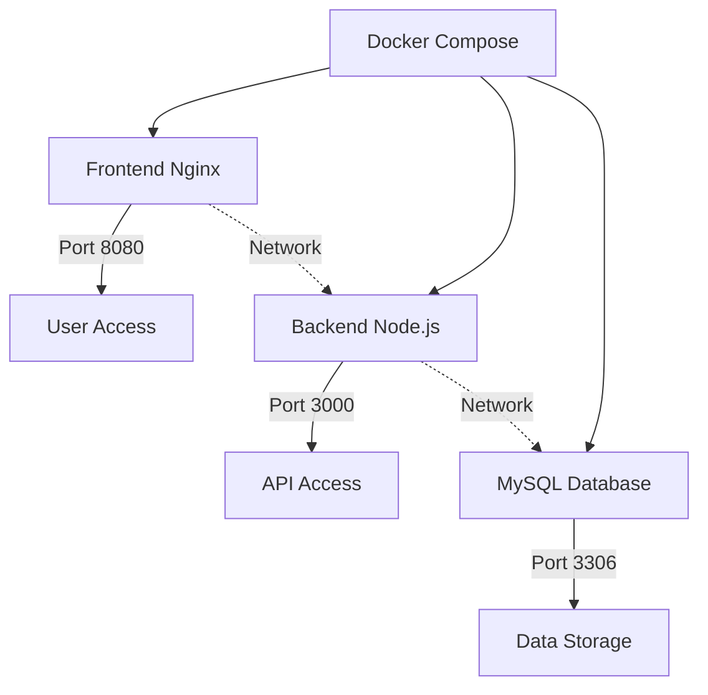
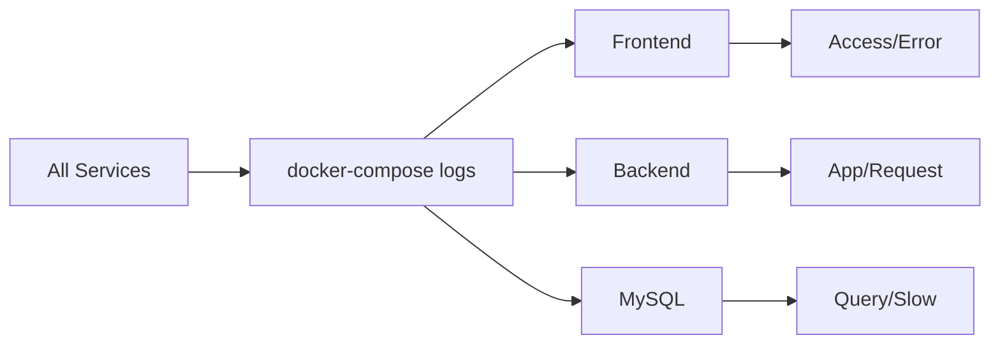
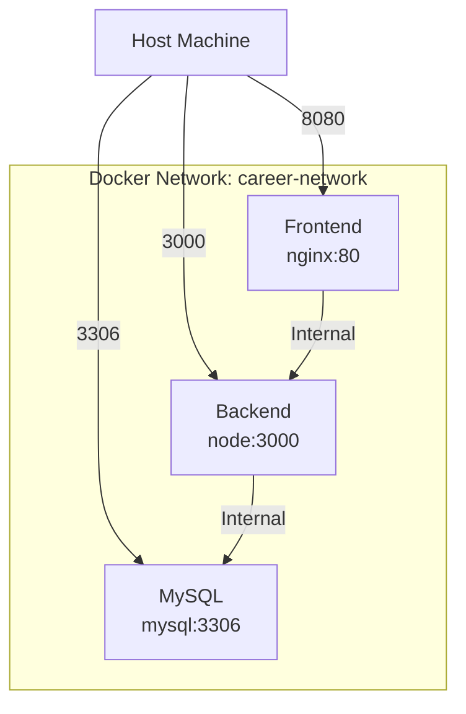
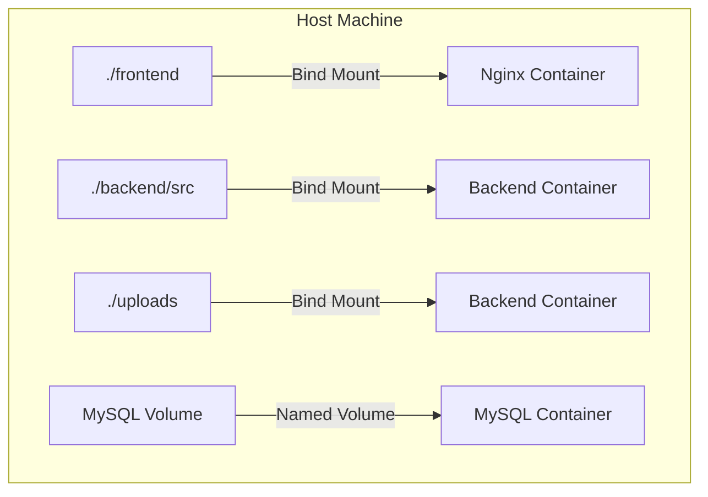

# 05 - Docker Debugging Guide

> Container management, orchestration, and debugging techniques

## Table of Contents
1. [Container Lifecycle Management](#container-lifecycle-management)
2. [Log Analysis](#log-analysis)
3. [Network Debugging](#network-debugging)
4. [Volume and Storage](#volume-and-storage)
5. [Resource Monitoring](#resource-monitoring)
6. [Health Checks](#health-checks)
7. [Troubleshooting Common Issues](#troubleshooting-common-issues)

---

## Container Lifecycle Management

### Container Architecture



### Essential Container Commands

```bash
# Start all services
docker-compose up -d

# Stop all services
docker-compose down

# Restart specific service
docker-compose restart backend

# View running containers
docker-compose ps

# View all containers (including stopped)
docker-compose ps -a

# Scale a service
docker-compose up -d --scale backend=3
```

### Container Status Inspection

```bash
# Detailed container info
docker-compose ps

# Output format:
# NAME                IMAGE               STATUS              PORTS
# career-frontend     nginx:alpine        Up 2 hours          0.0.0.0:8080->80/tcp
# career-backend      career-backend      Up 2 hours          0.0.0.0:3000->3000/tcp, 0.0.0.0:9229->9229/tcp
# career-mysql        mysql:8.0           Up 2 hours          0.0.0.0:3306->3306/tcp, 33060/tcp

# Inspect specific container
docker-compose exec backend env

# Check container processes
docker-compose top backend

# View container resource usage
docker-compose stats
```

---

## Log Analysis

### Multi-Service Log Aggregation



### Log Commands

```bash
# View all logs
docker-compose logs

# Follow logs in real-time
docker-compose logs -f

# View specific service
docker-compose logs -f backend

# View multiple services
docker-compose logs -f backend mysql

# Last N lines
docker-compose logs --tail=100 backend

# Since specific time
docker-compose logs --since=2026-03-19T10:00:00

# Until specific time
docker-compose logs --until=2026-03-19T12:00:00

# With timestamps
docker-compose logs -t backend
```

### Log Filtering

```bash
# Filter by keyword
docker-compose logs backend | grep -i error

# Filter by status code (Nginx)
docker-compose logs frontend | grep ' 500 '

# Multiple filters
docker-compose logs backend | grep -E '(error|warn|fatal)' | head -20

# Count occurrences
docker-compose logs backend | grep -c 'database connection'

# Save to file
docker-compose logs > all-logs.txt
docker-compose logs backend > backend-logs.txt
```

### Structured Log Analysis

```bash
# Parse JSON logs (if using structured logging)
docker-compose logs backend | grep '^{' | jq '.'

# Extract specific fields
docker-compose logs backend | grep '^{' | jq -r '.level, .message'

# Filter by severity
docker-compose logs backend | grep '^{' | jq 'select(.level == "error")'
```

---

## Network Debugging

### Network Architecture



### Network Inspection

```bash
# List Docker networks
docker network ls

# Inspect network
docker network inspect career-network

# View container IPs
docker network inspect career-network | grep -A 3 "Containers"

# Expected output:
# "Containers": {
#     "abc123...": {
#         "Name": "career-backend",
#         "IPv4Address": "172.20.0.3/16",
#     },
#     "def456...": {
#         "Name": "career-mysql",
#         "IPv4Address": "172.20.0.2/16",
#     }
# }
```

### Connectivity Testing

```bash
# Test from host to containers
curl http://localhost:8080/api/health
curl http://localhost:3000/api/health

# Test inter-container connectivity
docker-compose exec backend ping -c 3 mysql
docker-compose exec frontend ping -c 3 backend

# Test MySQL connection from backend
docker-compose exec backend nc -zv mysql 3306

# DNS resolution test
docker-compose exec backend nslookup mysql
docker-compose exec backend getent hosts mysql
```

### Port Mapping Verification

```bash
# View exposed ports
docker-compose port backend 3000
# Output: 0.0.0.0:3000

# List all port mappings
docker-compose ps --format "table {{.Name}}\t{{.Ports}}"

# Test port accessibility
nc -zv localhost 8080
nc -zv localhost 3000
nc -zv localhost 3306
```

---

## Volume and Storage

### Volume Architecture



### Volume Management

```bash
# List volumes
docker volume ls

# Inspect volume
docker volume inspect career-assessment_mysql_data

# View volume contents
docker run --rm -v career-assessment_mysql_data:/data alpine ls -la /data

# Backup volume
docker run --rm -v career-assessment_mysql_data:/data -v $(pwd):/backup alpine tar czf /backup/mysql-backup.tar.gz -C /data .

# Restore volume
docker run --rm -v career-assessment_mysql_data:/data -v $(pwd):/backup alpine sh -c "cd /data && tar xzf /backup/mysql-backup.tar.gz"
```

### Bind Mount Verification

```bash
# Check frontend mount
docker-compose exec frontend ls -la /usr/share/nginx/html/

# Check backend source mount
docker-compose exec backend ls -la /app/src/

# Test file sync
echo "// Test comment" >> backend/src/app.js
docker-compose exec backend cat /app/src/app.js | tail -3

# Check uploads directory
docker-compose exec backend ls -la /app/uploads/
```

### Storage Issues

```bash
# Check disk usage
docker system df

# Clean up unused resources
docker system prune        # Remove stopped containers, unused networks
docker system prune -a     # Also remove unused images
docker volume prune        # Remove unused volumes

# Check container disk usage
docker-compose exec mysql df -h
```

---

## Resource Monitoring

### Real-Time Stats

```bash
# View resource usage
docker-compose stats

# Output format:
# CONTAINER ID   NAME             CPU %   MEM USAGE / LIMIT     MEM %   NET I/O         BLOCK I/O   PIDS
# abc123         career-backend   0.5%    125.4MiB / 1.5GiB     8.2%    1.2MB / 2.3MB   0B / 0B     12
# def456         career-mysql     2.1%    512.3MiB / 1.5GiB     34.1%   890kB / 1.2MB   0B / 0B     45

# Stats with no stream (single snapshot)
docker-compose stats --no-stream

# Custom format
docker-compose stats --format "table {{.Container}}\t{{.CPUPerc}}\t{{.MemUsage}}"
```

### Resource Limits

```yaml
# docker-compose.yml
services:
  backend:
    deploy:
      resources:
        limits:
          cpus: '1.0'
          memory: 512M
        reservations:
          cpus: '0.5'
          memory: 256M
  
  mysql:
    deploy:
      resources:
        limits:
          memory: 1G
```

### Performance Profiling

```bash
# Container process list
docker-compose exec backend ps aux

# Top processes
docker-compose exec backend top -b -n 1

# Memory details
docker-compose exec backend cat /proc/meminfo | head -10

# File descriptors
docker-compose exec backend ls -la /proc/1/fd/ | wc -l
```

---

## Health Checks

### Health Check Configuration

```yaml
# docker-compose.yml
services:
  backend:
    healthcheck:
      test: ["CMD", "curl", "-f", "http://localhost:3000/api/health"]
      interval: 30s
      timeout: 10s
      retries: 3
      start_period: 40s
  
  mysql:
    healthcheck:
      test: ["CMD", "mysqladmin", "ping", "-h", "localhost"]
      interval: 10s
      timeout: 5s
      retries: 5
```

### Health Status Inspection

```bash
# Check container health
docker-compose ps

# Output shows health status:
# NAME                STATUS
# career-backend      Up 2 hours (healthy)
# career-mysql        Up 2 hours (healthy)

# Detailed health info
docker-compose exec backend cat /tmp/healthcheck.log

# Force health check
docker-compose exec backend curl http://localhost:3000/api/health
```

### Dependency Management

```yaml
# docker-compose.yml
services:
  backend:
    depends_on:
      mysql:
        condition: service_healthy
    # Backend won't start until MySQL is healthy
```

---

## Troubleshooting Common Issues

### Issue 1: Container Exits Immediately

**Symptoms:**
```bash
docker-compose ps
# NAME                STATUS
# career-backend      Exit 1
```

**Debugging:**
```bash
# View exit logs
docker-compose logs backend

# Check exit code
docker-compose ps -a

# Run without detaching to see error
docker-compose up backend

# Common causes:
# - Port already in use
# - Missing environment variables
# - Database connection failed
# - Syntax error in code
```

**Solutions:**

Port conflict:
```bash
# Find process using port
lsof -i :3000

# Kill process or change port in docker-compose.yml
```

Environment missing:
```bash
# Check .env exists
ls -la .env

# Create from example
cp .env.example .env
```

### Issue 2: Changes Not Reflecting

**Symptoms:**
- Modified code but no changes in container
- Bind mount not working

**Debugging:**
```bash
# Verify bind mount
docker-compose exec backend ls -la /app/src/

# Check mount in container inspect
docker-compose exec backend mount | grep /app

# Test file change
echo "console.log('test');" > backend/src/test.js
docker-compose exec backend cat /app/src/test.js
```

**Solution:**
```bash
# Restart to pick up changes
docker-compose restart backend

# Or recreate container
docker-compose up -d --force-recreate backend
```

### Issue 3: Database Connection Refused

**Symptoms:**
- Backend cannot connect to MySQL
- Error: "Connection refused"

**Debugging:**
```bash
# Check MySQL status
docker-compose ps mysql

# View MySQL logs
docker-compose logs mysql

# Test connection from backend
docker-compose exec backend nc -zv mysql 3306

# Check if MySQL is ready
docker-compose exec mysql mysqladmin status
```

**Solution:**
```bash
# Wait for MySQL to be healthy
docker-compose up -d
sleep 10
docker-compose ps

# Or restart both
docker-compose restart mysql backend
```

### Issue 4: Permission Denied on Volumes

**Symptoms:**
- Cannot write to uploads directory
- Permission errors in logs

**Debugging:**
```bash
# Check ownership
docker-compose exec backend ls -la /app/uploads/

# Check user ID
docker-compose exec backend id

# Check host permissions
ls -la uploads/
```

**Solution:**
```bash
# Fix permissions
chmod 777 uploads/

# Or use user mapping in docker-compose
services:
  backend:
    user: "${UID}:${GID}"
```

### Issue 5: Out of Disk Space

**Symptoms:**
- Cannot create containers
- Write errors

**Debugging:**
```bash
# Check disk usage
df -h

# Check Docker disk usage
docker system df -v

# Large images
docker images --format "{{.Size}}\t{{.Repository}}" | sort -hr

# Large volumes
docker volume ls -q | xargs -I {} docker run --rm -v {}:/data alpine du -sh /data
```

**Cleanup:**
```bash
# Remove unused data
docker system prune -a --volumes

# Remove specific containers
docker rm $(docker ps -aq --filter "status=exited")

# Remove old images
docker image prune -a --filter "until=240h"
```

---

## Debug Checklist

When Docker issues occur:

- [ ] Check container status: `docker-compose ps`
- [ ] View logs: `docker-compose logs -f [service]`
- [ ] Test health: `docker-compose exec [service] [health-check]`
- [ ] Verify network: `docker-compose exec [service] ping [other-service]`
- [ ] Check volumes: `docker-compose exec [service] ls -la [path]`
- [ ] Test ports: `nc -zv localhost [port]`
- [ ] Check resources: `docker-compose stats`
- [ ] Verify environment: `docker-compose exec [service] env`
- [ ] Test configuration: `docker-compose config`
- [ ] Restart service: `docker-compose restart [service]`

---

## Quick Reference

```bash
# Complete restart
docker-compose down
docker-compose up -d --build

# View all logs
docker-compose logs -f

# Debug specific service
docker-compose run --rm backend sh

# Execute command in running container
docker-compose exec backend node -e "console.log('test')"

# Copy files
docker-compose cp backend:/app/logs ./logs-backup

# Run one-off command
docker-compose run --rm backend npm test
```

---

**Next**: [06-common-issues.md](06-common-issues.md) - Quick reference for frequent problems