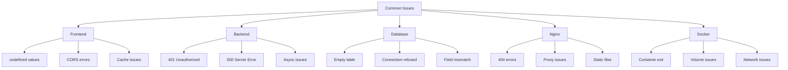
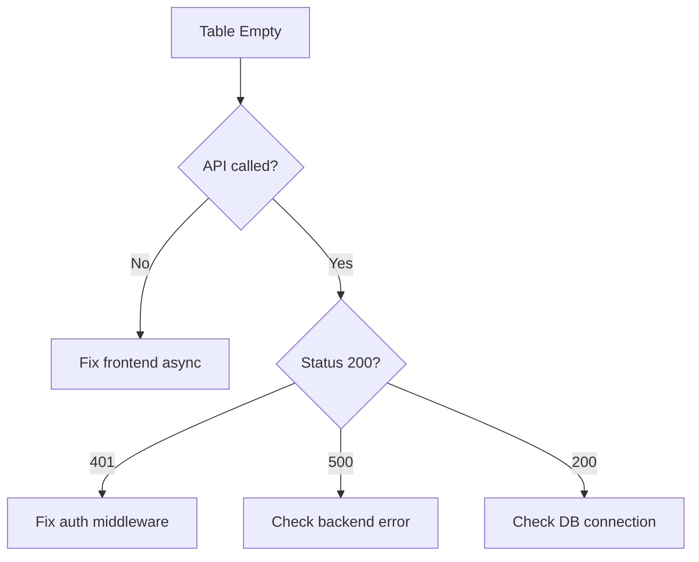

# 06 - Common Issues Quick Reference

> Rapid troubleshooting guide for frequently encountered problems

## Quick Navigation



---

## Frontend Issues

### Issue: Data Shows "undefined"

| Aspect | Details |
|--------|---------|
| **Symptoms** | UI shows "undefined" instead of actual values, especially dates |
| **Root Cause** | Field name mismatch between frontend expectation and backend response |
| **Quick Check** | Open Network tab → Response → Verify field names |

**Diagnostic Commands:**
```bash
# Check API response
curl -s http://localhost:8080/api/assessments -b cookies.txt | jq '.data.assessments[0]'
```

**Solution:**
```javascript
// ❌ Wrong field name
date: a.createdAt  // API returns created_at

// ✅ Correct mapping
date: a.created_at || a.createdAt  // Handle both cases

// Or map in API layer
createdAt: a.created_at ? new Date(a.created_at).toLocaleString('zh-CN') : null
```

**Related:** [01-frontend-debugging.md](01-frontend-debugging.md#data-flow-validation)

---

### Issue: API Calls Return 401

| Aspect | Details |
|--------|---------|
| **Symptoms** | All admin requests return 401, login appears to work |
| **Root Cause** | Session not persisted, cookies not sent, or auth middleware misconfigured |
| **Quick Check** | Check Application tab → Cookies → connect.sid exists? |

**Diagnostic Commands:**
```bash
# Test login
curl -X POST http://localhost:8080/api/admin/login \
  -H "Content-Type: application/json" \
  -d '{"password": "Lonlink789"}' \
  -c cookies.txt -v

# Check if cookie is set
cat cookies.txt | grep connect.sid

# Test with cookie
curl -s http://localhost:8080/api/admin/check -b cookies.txt
```

**Solution:**
```javascript
// Backend: Check cookie settings
app.use(session({
  secret: process.env.SESSION_SECRET,
  resave: false,
  saveUninitialized: false,
  cookie: {
    secure: false,  // Must be false for HTTP
    httpOnly: true,
    maxAge: 24 * 60 * 60 * 1000
  }
}));
```

**Related:** [02-backend-debugging.md](02-backend-debugging.md#authentication--session-debugging)

---

### Issue: CORS Policy Error

| Aspect | Details |
|--------|---------|
| **Symptoms** | Console shows "No 'Access-Control-Allow-Origin' header" |
| **Root Cause** | Frontend trying to access API on different origin |
| **Quick Check** | Network tab → Check if request URL is absolute (http://localhost:3000) |

**Solution:**
```javascript
// ❌ Wrong - Absolute URL causes CORS
const API_BASE_URL = 'http://localhost:3000/api';

// ✅ Correct - Relative URL uses Nginx proxy
const API_BASE_URL = '/api';
```

**Related:** [04-nginx-debugging.md](04-nginx-debugging.md#case-4-cors-headers-missing)

---

### Issue: Code Changes Not Reflected

| Aspect | Details |
|--------|---------|
| **Symptoms** | Modified code but browser still shows old version |
| **Root Cause** | Browser cache, Nginx cache, or volume not synced |
| **Quick Check** | Network tab → Disable cache → Refresh |

**Solutions (try in order):**

1. **Force Refresh**
   - Windows/Linux: `Ctrl + Shift + R`
   - Mac: `Cmd + Shift + R`

2. **Disable Cache**
   ```bash
   # In DevTools Network tab, check "Disable cache"
   ```

3. **Clear LocalStorage**
   ```javascript
   localStorage.clear();
   ```

4. **Restart Nginx**
   ```bash
   docker-compose restart frontend
   ```

**Related:** [01-frontend-debugging.md](01-frontend-debugging.md#caching-issues)

---

### Issue: Async Function Returns Early

| Aspect | Details |
|--------|---------|
| **Symptoms** | Results shown before data saved, race conditions |
| **Root Cause** | Missing `await` on async function call |
| **Quick Check** | Console shows "Save complete" AFTER "Showing results" |

**Solution:**
```javascript
// ❌ Wrong - No await, returns immediately
function handleFinish() {
    saveAssessment(data);
    showResults();  // Runs before save completes
}

// ✅ Correct - Wait for completion
async function handleFinish() {
    await saveAssessment(data);
    showResults();  // Only after save
}
```

**Related:** [01-frontend-debugging.md](01-frontend-debugging.md#javascript-async-debugging)

---

## Backend Issues

### Issue: Data Not Saved to Database

| Aspect | Details |
|--------|---------|
| **Symptoms** | Assessment completed, LocalStorage has data, MySQL empty |
| **Root Cause** | Create endpoint protected by auth middleware |
| **Quick Check** | `docker-compose logs backend` shows 401 for POST /api/assessments |

**Diagnostic Commands:**
```bash
# Test without auth
curl -X POST http://localhost:8080/api/assessments \
  -H "Content-Type: application/json" \
  -d '{"assessmentId": "test", "userInfo": {"name": "Test"}, "scores": {"totalScore": 80}}'

# If returns 401, route requires auth
```

**Solution:**
```javascript
// backend/src/app.js

// ❌ Wrong - All routes protected
app.use('/api/assessments', requireAuth, assessmentRoutes);

// ✅ Correct - Create is public, others protected
app.post('/api/assessments', assessmentController.createAssessment);
app.use('/api/assessments', requireAuth, assessmentRoutes);
```

**Related:** [02-backend-debugging.md](02-backend-debugging.md#case-1-api-calls-return-404)

---

### Issue: 500 Internal Server Error

| Aspect | Details |
|--------|---------|
| **Symptoms** | API returns 500, no response body |
| **Root Cause** | Unhandled exception in route handler |
| **Quick Check** | `docker-compose logs backend` for stack trace |

**Diagnostic Commands:**
```bash
# View error logs
docker-compose logs backend | grep -A 10 "Error:"

# Common patterns:
# - "Validation error" → Missing required field
# - "Connection refused" → Database down
# - "Cannot read property" → Null reference
```

**Solution:**
```javascript
// Wrap async handlers
try {
    const result = await someAsyncOperation();
    res.json({ success: true, data: result });
} catch (error) {
    console.error('Operation failed:', error);
    res.status(500).json({ 
        error: 'Operation failed',
        message: error.message 
    });
}
```

**Related:** [02-backend-debugging.md](02-backend-debugging.md#error-handling--stack-traces)

---

### Issue: Session Lost After Refresh

| Aspect | Details |
|--------|---------|
| **Symptoms** | Must login again after page refresh |
| **Root Cause** | saveUninitialized set to true or cookie expires quickly |
| **Quick Check** | Application tab → Cookies → Check Expires/Max-Age |

**Solution:**
```javascript
app.use(session({
    secret: process.env.SESSION_SECRET,
    resave: false,
    saveUninitialized: false,  // Don't save empty sessions
    cookie: {
        maxAge: 24 * 60 * 60 * 1000,  // 24 hours
        secure: false  // Set to true only with HTTPS
    }
}));
```

---

## Database Issues

### Issue: Assessments Table Empty

| Aspect | Details |
|--------|---------|
| **Symptoms** | Admin dashboard shows 0 records, MySQL table empty |
| **Root Cause** | Backend not saving or frontend not calling API |
| **Quick Check** | Check if frontend makes POST request to /api/assessments |

**Diagnostic Commands:**
```bash
# Check database
docker-compose exec mysql mysql -u root -ppassword -e \
  "USE career_assessment; SELECT COUNT(*) FROM assessments;"

# If 0, check backend logs
docker-compose logs backend | grep "POST /api/assessments"
```

**Solution Flow:**


**Related:** [03-database-debugging.md](03-database-debugging.md#data-verification-queries)

---

### Issue: MySQL Connection Refused

| Aspect | Details |
|--------|---------|
| **Symptoms** | Backend cannot connect, "ECONNREFUSED 172.18.0.2:3306" |
| **Root Cause** | MySQL container not running or not ready |
| **Quick Check** | `docker-compose ps` shows MySQL status |

**Diagnostic Commands:**
```bash
# Check MySQL status
docker-compose ps mysql

# View MySQL logs
docker-compose logs mysql | tail -20

# Test connection
docker-compose exec mysql mysqladmin ping

# Check network
docker-compose exec backend ping mysql
```

**Solution:**
```bash
# Restart MySQL
docker-compose restart mysql
sleep 10

# Verify
docker-compose exec mysql mysql -u root -ppassword -e "SELECT 1;"
```

**Related:** [03-database-debugging.md](03-database-debugging.md#connection-troubleshooting)

---

### Issue: Date Shows "Invalid Date"

| Aspect | Details |
|--------|---------|
| **Symptoms** | Date formatting fails or shows "Invalid Date" |
| **Root Cause** | Date string format mismatch or timezone issues |
| **Quick Check** | API response format vs frontend parsing |

**Solution:**
```javascript
// Backend - Format consistently
createdAt: assessment.created_at ? 
    new Date(assessment.created_at).toLocaleString('zh-CN') : null

// Frontend - Handle gracefully
const formattedDate = dateString ? 
    new Date(dateString).toLocaleString('zh-CN') : '-';
```

---

## Nginx Issues

### Issue: API Returns 404 Through Nginx

| Aspect | Details |
|--------|---------|
| **Symptoms** | Direct backend access works, through Nginx returns 404 |
| **Root Cause** | Wrong proxy_pass path (stripping /api/) |
| **Quick Check** | `curl http://localhost:8080/api/health` returns 404 |

**Diagnostic:**
```bash
# Test direct backend
curl http://localhost:3000/api/health  # Works ✓

# Test through Nginx
curl http://localhost:8080/api/health  # 404 ✗
```

**Solution:**
```nginx
# ❌ WRONG - Strips /api/
location /api/ {
    proxy_pass http://backend:3000/;
}

# ✅ CORRECT - Preserves path
location /api/ {
    proxy_pass http://backend:3000/api/;
}
```

**Related:** [04-nginx-debugging.md](04-nginx-debugging.md#case-1-api-calls-return-404)

---

### Issue: SPA Routes 404 on Refresh

| Aspect | Details |
|--------|---------|
| **Symptoms** | Clicking navigation works, refresh returns Nginx 404 |
| **Root Cause** | Missing fallback to index.html |
| **Quick Check** | Access `/admin` directly in address bar |

**Solution:**
```nginx
location / {
    # ❌ WRONG
    try_files $uri $uri/ =404;
    
    # ✅ CORRECT
    try_files $uri $uri/ /index.html;
}
```

**Related:** [04-nginx-debugging.md](04-nginx-debugging.md#case-3-spa-routes-404-on-refresh)

---

### Issue: Static Files Not Updating

| Aspect | Details |
|--------|---------|
| **Symptoms** | Updated JS/CSS but browser shows old version |
| **Root Cause** | Aggressive caching in Nginx config |
| **Quick Check** | Response headers show Cache-Control: max-age=31536000 |

**Solution:**
```nginx
# For development - Disable cache
location ~* \\.(js|css)$ {
    expires -1;
    add_header Cache-Control "no-cache, no-store, must-revalidate";
}

# Or add version query parameter in HTML
<script src="js/api.js?v=1.0.1"></script>
```

**Related:** [04-nginx-debugging.md](04-nginx-debugging.md#case-2-static-files-not-updating)

---

## Docker Issues

### Issue: Container Exits Immediately

| Aspect | Details |
|--------|---------|
| **Symptoms** | `docker-compose ps` shows Exit status |
| **Root Cause** | Application crash, missing dependency, or port conflict |
| **Quick Check** | `docker-compose logs [service]` for error |

**Diagnostic Commands:**
```bash
# Check exit code
docker-compose ps -a

# View error
docker-compose logs backend

# Run interactively
docker-compose up backend

# Check port conflicts
lsof -i :3000
```

**Common Causes & Solutions:**

Port conflict:
```bash
# Change port in docker-compose.yml
ports:
  - "3001:3000"  # Host:Container
```

Missing environment:
```bash
# Create .env
cp .env.example .env
```

**Related:** [05-docker-debugging.md](05-docker-debugging.md#issue-1-container-exits-immediately)

---

### Issue: Changes Not Syncing to Container

| Aspect | Details |
|--------|---------|
| **Symptoms** | Edited code not reflecting in container |
| **Root Cause** | Bind mount not working or file permissions |
| **Quick Check** | `docker-compose exec [service] ls -la [path]` |

**Solution:**
```bash
# Verify mount
docker-compose config | grep -A 3 volumes

# Check file in container
docker-compose exec backend cat /app/src/app.js

# Restart to pick up changes
docker-compose restart backend

# Or recreate
docker-compose up -d --force-recreate backend
```

---

## Emergency Procedures

### Total System Reset

```bash
# ⚠️ WARNING: Destroys all data!
# Use only for complete reset

docker-compose down -v  # Stop and remove volumes
docker system prune -a   # Clean up images
docker volume prune      # Clean up volumes

# Rebuild and start
docker-compose up -d --build

# Verify
docker-compose ps
curl http://localhost:8080/api/health
```

### Safe Restart Sequence

```bash
# Keep data, restart services
docker-compose down
docker-compose up -d

# Or restart specific service
docker-compose restart backend
```

### Backup Before Major Changes

```bash
# Backup database
docker-compose exec mysql mysqldump -u root -ppassword career_assessment > backup.sql

# Backup uploads
tar -czvf uploads-backup.tar.gz uploads/

# Git commit
git add .
git commit -m "Backup before debugging"
```

---

## Quick Command Reference

```bash
# System health check
docker-compose ps
docker-compose logs -f
curl http://localhost:8080/api/health

# Frontend debugging
docker-compose logs -f frontend
docker-compose restart frontend

# Backend debugging
docker-compose logs -f backend
docker-compose restart backend
curl http://localhost:3000/api/health

# Database debugging
docker-compose logs -f mysql
docker-compose exec mysql mysql -u root -ppassword -e "SELECT COUNT(*) FROM career_assessment.assessments;"

# Network debugging
docker-compose exec backend ping mysql
docker network inspect career-network

# Complete restart
docker-compose down
docker-compose up -d --build
```

---

**Next**: [07-command-cheatsheet.md](07-command-cheatsheet.md) - Complete command reference