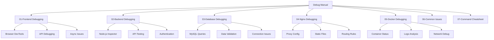
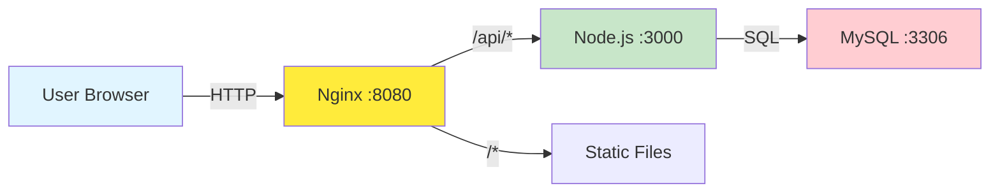
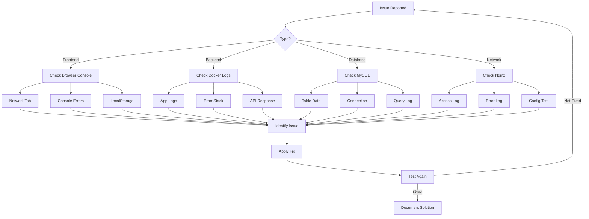

# Career Assessment System - Debug Manual

> Comprehensive debugging guide for developers and DevOps engineers

## 📚 Document Structure

## 🚀 Quick Start

### System Architecture

### Debug Ports Reference

| Service | Port | Purpose | Access Command |
|---------|------|---------|----------------|
| Frontend | 8080 | Web Application | `http://localhost:8080` |
| Backend API | 3000 | REST API | `http://localhost:3000/api` |
| Node Inspector | 9229 | Debug Node.js | `chrome://inspect` |
| MySQL | 3306 | Database | `mysql -h localhost -P 3306` |
| MySQL X Protocol | 33060 | Extended Protocol | MySQL Shell |

## 📖 Document Guide

### For Frontend Developers
Start with:
1. [01-frontend-debugging.md](01-frontend-debugging.md) - Browser DevTools, API calls, async debugging
2. [06-common-issues.md](06-common-issues.md) - Quick reference for undefined values, caching issues

### For Backend Developers
Start with:
1. [02-backend-debugging.md](02-backend-debugging.md) - Node.js debugging, API testing
2. [03-database-debugging.md](03-database-debugging.md) - MySQL queries and data validation
3. [04-nginx-debugging.md](04-nginx-debugging.md) - Reverse proxy and routing

### For DevOps Engineers
Start with:
1. [05-docker-debugging.md](05-docker-debugging.md) - Container management and logs
2. [04-nginx-debugging.md](04-nginx-debugging.md) - Load balancer and static files
3. [07-command-cheatsheet.md](07-command-cheatsheet.md) - Quick commands reference

## 🔍 Debug Workflow

## 🛠️ Environment Setup

### Required Tools
- Docker & Docker Compose
- curl or HTTP client (Postman, Insomnia)
- MySQL client
- Node.js (for local debugging)
- Modern web browser with DevTools

### Optional Tools
- VS Code with debugging extensions
- MySQL Workbench
- Nginx (for local config testing)

## 📝 Contributing

When adding new debug scenarios:
1. Identify the component (Frontend/Backend/Database/Nginx/Docker)
2. Add to the appropriate document
3. Include actual error messages and solutions
4. Add to [06-common-issues.md](06-common-issues.md) if applicable

## ⚡ Emergency Contacts

- **System Down**: Check Docker first → `docker-compose ps`
- **Data Loss**: Check MySQL backups → `database/init.sql`
- **Security Issue**: Check `.env` files are in `.gitignore`

---

**Last Updated**: 2026-03-19  
**Version**: 1.0.0  
**Maintainers**: Development Team